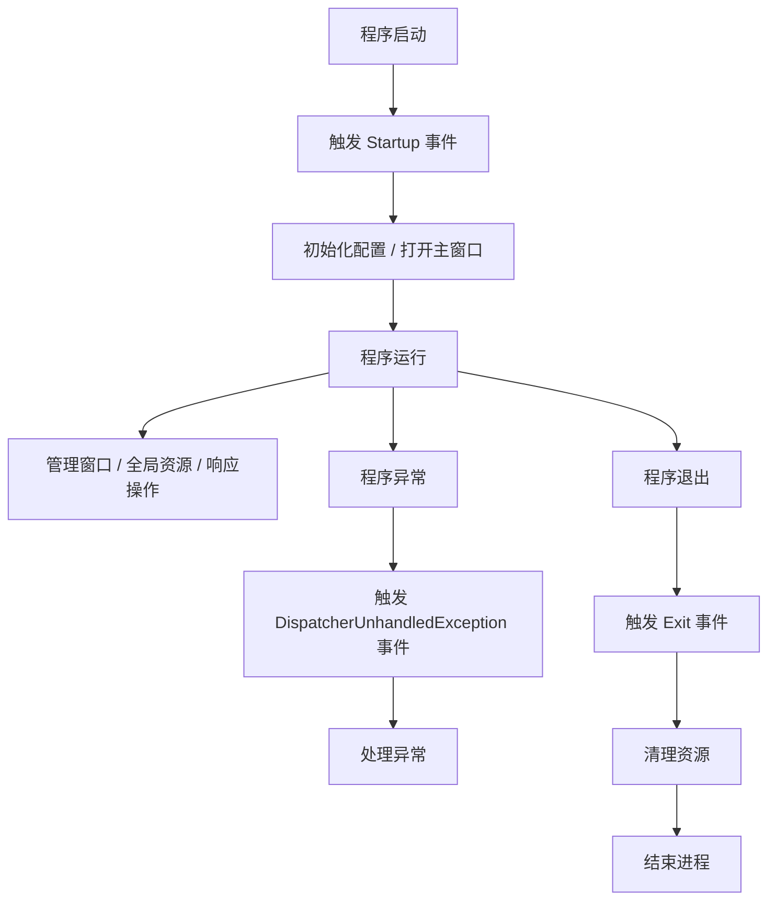
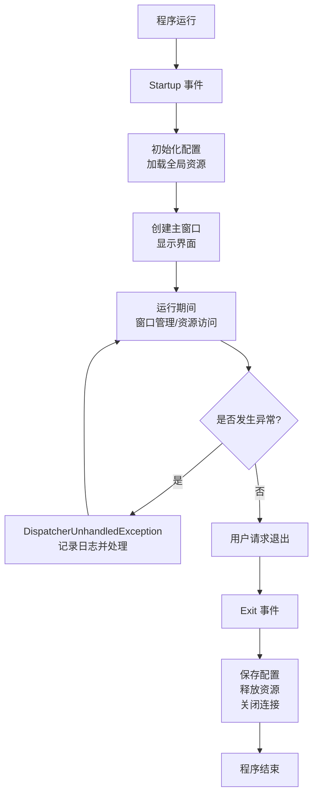

# 001001003_Application类详细解析


**摘要**：Application 类是 WPF 应用程序的全局管理中心，作为程序的"总管家"和"大脑"，它负责管理从启动到退出的完整生命周期、所有窗口、全局资源、全局事件和运行状态。本文详细解析了 Application 类的五大核心能力：1) 掌控应用生命周期；2) 管理所有窗口；3) 管理全局资源；4) 全局单例访问；5) 控制程序退出。同时提供了新手使用指南、工业场景实用技巧以及最佳实践清单，帮助开发者构建健壮、可维护的工业级 WPF 应用程序。


​	Application 类是 WPF 程序的 **“总管家”**——简单来说，它是整个应用程序的“大脑”，负责管理程序从启动到退出的全生命周期，掌控所有窗口、全局资源、全局事件和运行状态。

可以将其类比为：

- 如同公司的「总经理」：管理所有“员工”（窗口、控件），制定“规矩”（全局资源/配置），处理“突发状况”（全局异常），决定公司“开门营业”（启动）和“关门歇业”（退出）。
- 如同手机的「系统设置」：所有应用共用的字体、主题属于“全局资源”，手机的开机/关机对应“生命周期”，系统弹窗处理崩溃则是“全局异常”——Application 类正是负责这些事务。
- 如何在启动程序时决定首先显示哪个窗体？答案是 Application 类的 StartupUri 属性。StartupUri 属性是 Uri 类型，即统一资源标识符（URI），它可以指定应用程序首次启动时显示的用户界面（UI）。

## 一、Application 类的核心定位

​	每个 WPF 程序**有且只有一个 Application 实例**（单例），从程序启动到退出全程存在，主要负责：

1. **管理生命周期**：启动、运行、退出的全流程；
2. **管理窗口**：所有打开的窗口都归其管理（主窗口、子窗口）；
3. **管理全局资源**：所有窗口共用的样式、颜色、字符串等；
4. **管理全局事件**：程序级的异常、启动参数、退出清理等；
5. **管理全局状态**：整个程序共用的数据、配置等。

## 二、Application 类的核心能力（逐项详解）

### 1. 掌控应用生命周期（最核心）

​	就像人从 “出生→活着→死亡”，Application 类管着程序的 “生老病死”，核心阶段和对应操作如下：

| 生命周期阶段                   | 通俗解释                          | 常用操作                                     |
| :----------------------------- | :-------------------------------- | :------------------------------------------- |
| 启动（Startup）                | 程序刚启动，还未显示任何窗口| 处理命令行参数、初始化配置、选择启动哪个窗口 |
| 运行（Running）                | 程序正常工作，用户操作窗口 / 控件 | 管理窗口、响应全局事件、共享数据             |
| 退出（Exit）                   | 程序准备退出，在所有窗口关闭前   | 保存配置、关闭数据库连接、释放内存           |
| 异常崩溃（UnhandledException） | 程序出现未被局部代码捕获的异常    | 记录日志、显示友好提示、防止程序直接闪退     |

#### 通俗示例：生命周期的实际应用

```csharp

```csharp
// App.xaml.cs（Application的子类）
public partial class App : Application
{
    // 1. 程序启动时
    private void App_Startup(object sender, StartupEventArgs e)
    {
        // 第一步：检查配置文件是否存在
        if (!File.Exists("config.json"))
        {
            MessageBox.Show("配置文件丢失，程序无法启动！");
            Shutdown(); // 直接关门（退出程序）
            return;
        }

        // 第二步：处理命令行参数（例如用户通过双击文件启动程序）
        if (e.Args.Length > 0)
        {
            string filePath = e.Args[0];
            // 把文件路径传给主窗口（让主窗口加载这个文件）
            MainWindow = new MainWindow(filePath);
        }
        else
        {
            // 没参数就打开默认主窗口
            MainWindow = new MainWindow();
        }

        // 显示主窗口（公司正式营业）
        MainWindow.Show();
    }

    // 2. 程序退出时（总经理下班前收尾）
    private void App_Exit(object sender, ExitEventArgs e)
    {
        // 保存用户的个性化设置（比如窗口大小、主题）
        ConfigHelper.Save("windowSize", MainWindow.Size);
        // 关闭数据库连接（避免数据丢失）
        DbHelper.Close();
        // 记录程序退出日志（方便排查问题）
        LogHelper.Write("程序正常退出");
    }

    // 3. 程序出异常时（处理突发故障）
    private void App_DispatcherUnhandledException(object sender, DispatcherUnhandledExceptionEventArgs e)
    {
        // 显示友好提示（不直接闪退，用户体验好）
        MessageBox.Show($"抱歉，程序出了点小问题：{e.Exception.Message}", "提示", MessageBoxButton.OK, MessageBoxImage.Warning);
        // 记录详细异常日志（方便开发人员排查）
        LogHelper.Error("程序异常", e.Exception);
        // 标记异常已处理（防止程序崩溃）
        e.Handled = true;
    }
}
```

### 2. 管理所有窗口（全局窗口控制）

​	Application 类能“看到”程序中所有打开的窗口，并能控制它们的显示与关闭，例如：

#### （1）指定主窗口（MainWindow）

​	主窗口是程序的 “核心窗口”，关闭主窗口默认会退出程序（如同公司的总部，总部关闭则公司停止运营）：

C#：

```c#
// 在启动时指定主窗口
App.Current.MainWindow = new MainWindow();
App.Current.MainWindow.Show();

// 在任意位置访问主窗口（比如子窗口要给主窗口传数据）
MainWindow mainWin = (MainWindow)App.Current.MainWindow;
mainWin.UpdateData("新数据");
```

#### （2）遍历 / 关闭所有窗口

​	比如用户点击 “退出” 按钮，要关闭所有打开的子窗口再退出：

C#：

```csharp
private void ExitButton_Click(object sender, RoutedEventArgs e)
{
    // 反向遍历（避免删除时索引错乱）：关闭所有子窗口
    for (int i = App.Current.Windows.Count - 1; i >= 0; i--)
    {
        // 跳过主窗口（最后关主窗口）
        if (App.Current.Windows[i] != App.Current.MainWindow)
        {
            App.Current.Windows[i].Close();
        }
    }
    // 关闭主窗口（触发Exit事件，程序退出）
    App.Current.MainWindow.Close();
}
```

#### （3）查找指定窗口

例如，要查找名为“设置窗口”的子窗口，避免重复打开：

C#：

```csharp
private void OpenSettingWindow()
{
    // 先检查是否已有设置窗口打开
    Window settingWin = App.Current.Windows.OfType<SettingWindow>().FirstOrDefault();
    if (settingWin == null)
    {
        // 若不存在则新建
        settingWin = new SettingWindow();
        settingWin.Show();
    }
    else
    {
        // 有就激活（调到最前面）
        settingWin.Activate();
    }
}
```

### 3. 管理全局资源（所有窗口共用）

Application 类的 `Resources` 属性是“全局资源池”，其中的资源（样式、颜色、字符串）可供所有窗口直接使用，无需重复定义（如同公司的公共物资，所有部门均可取用）。

#### （1）在 XAML 中定义全局资源（App.xaml）

XAML：

```xml
<Application ...>
    <Application.Resources>
        <!-- 全局颜色：所有窗口都能用 -->
        <SolidColorBrush x:Key="MainColor" Color="#007ACC"/>
        <!-- 全局按钮样式：所有窗口的按钮都用这个样式 -->
        <Style TargetType="Button">
            <Setter Property="Width" Value="100"/>
            <Setter Property="Height" Value="30"/>
            <Setter Property="Background" Value="{StaticResource MainColor}"/>
        </Style>
    </Application.Resources>
</Application>
```

#### （2）在代码中访问 / 修改全局资源

​	比如用户切换 “白天 / 黑夜模式”，动态修改全局颜色：

C#：

```csharp
// 切换到黑夜模式
private void SwitchDarkMode()
{
    // 替换全局主颜色
    App.Current.Resources["MainColor"] = new SolidColorBrush(Colors.DarkSlateGray);
    // 所有窗口的按钮颜色会自动更新（绑定的效果）
}
```

### 4. 全局单例访问（App.Current）

Application 类是“单例”——整个程序只有一个实例，通过 `App.Current` 能在**任意位置**访问它（类似于全公司都能找到总经理）：

```csharp
// 在子窗口中访问全局资源
var mainColor = App.Current.Resources["MainColor"];

// 在控件中退出程序
App.Current.Shutdown();

// 在工具类中获取主窗口
var mainWin = App.Current.MainWindow;
```

### 5. 控制程序退出（Shutdown）

主动退出程序有两种方式，二者均会触发 `Exit` 事件（执行收尾工作）：

C#：

```csharp
// 方式一：正常退出（退出码 0，表示正常）
App.Current.Shutdown();

// 方式二：带退出码退出（1 表示异常退出，便于日志排查）
App.Current.Shutdown(1);
```

## 三、Application 类的使用方式（新手必读）

### 1. 如何创建 Application 实例？

​	新建 WPF 项目时，VS 会自动生成：

- `App.xaml`：XAML 配置文件，对应 Application 类；
- `App.xaml.cs`：代码后台，继承自 Application 类（partial 类）。

​	无需手动实例化 `Application` 类，WPF 框架会自动创建 Application 实例，开发者只需在 `App.xaml.cs` 中编写逻辑即可。

### 2. 核心使用流程




## 四、工业场景常用技巧（避坑与实用）

### 1. 禁止程序多开（只允许打开一个实例）

工业软件通常不允许用户运行多个实例，以避免冲突：

C#：

```csharp
private void App_Startup(object sender, StartupEventArgs e)
{
    // 创建互斥锁（唯一标识）
    using (Mutex mutex = new Mutex(true, "MyIndustrialApp_Mutex", out bool isNewInstance))
    {
        if (isNewInstance)
        {
            // 新实例：正常启动
            MainWindow = new MainWindow();
            MainWindow.Show();
        }
        else
        {
            // 已有实例：提示并退出
            MessageBox.Show("程序已在运行中！", "提示");
            Shutdown();
        }
    }
}
```

### 2. 全局异常捕获（避免程序闪退）

​	工业软件必须处理未捕获的异常，否则用户体验极差：

```csharp

```csharp
private void App_DispatcherUnhandledException(object sender, DispatcherUnhandledExceptionEventArgs e)
{
    // 1. 记录详细异常日志（包括堆栈信息）
    LogHelper.Error($"异常时间：{DateTime.Now}\n异常信息：{e.Exception.Message}\n堆栈：{e.Exception.StackTrace}");
    // 2. 显示友好提示
    MessageBox.Show("程序运行出错，请联系管理员查看日志！", "错误", MessageBoxButton.OK, MessageBoxImage.Error);
    // 3. 标记异常已处理（不崩溃）
    e.Handled = true;
}
```

### 3. 全局数据共享（不用传参）

在 Application 子类中定义静态属性，实现全程序数据共享：

C#:

```c#
// App.xaml.cs
public partial class App : Application
{
    // 全局用户信息（所有窗口都能访问）
    public static User CurrentUser { get; set; }

    // 全局配置（启动时加载，各处均可访问）
    public static AppConfig GlobalConfig { get; set; }

    private void App_Startup(object sender, StartupEventArgs e)
    {
        // 启动时加载全局配置
        GlobalConfig = ConfigHelper.Load();
    }
}

// 在任意窗口中使用：
private void LoginSuccess(User user)
{
    // 保存登录用户
    App.CurrentUser = user;
    // 使用全局配置
    string serverIp = App.GlobalConfig.ServerIp;
}
```


## 五、总结与最佳实践

### 核心要点提炼

通过前文的详细解析，我们可以将 Application 类的核心价值总结为以下 5 个关键点：

1. **全局单例中枢**：Application 是 WPF 程序的唯一全局实例（单例），通过 `App.Current` 可在任意位置访问，是整个应用的统一控制中心。

2. **全生命周期管理**：从启动（Startup）、运行到退出（Exit），Application 掌控着程序的完整生命周期，并能通过事件机制在关键节点注入业务逻辑。

3. **窗口统一管控**：作为所有窗口的"总管家"，Application 能够指定主窗口、遍历所有窗口、查找特定窗口，并统一控制窗口的显示与关闭。

4. **资源集中共享**：通过 `Resources` 属性提供全局资源池，实现样式、颜色、数据模板等资源的集中定义与跨窗口共享，避免重复定义。

5. **异常全局兜底**：通过 `DispatcherUnhandledException` 事件捕获未处理异常，防止程序直接闪退，提升工业级应用的稳定性和用户体验。

### 工业级最佳实践清单

在工业级 WPF 应用开发中，遵循以下最佳实践能显著提升应用的健壮性、可维护性和用户体验：

| 实践类别 | 具体实践 | 原因说明 | 代码示例/关键点 |
| :--- | :--- | :--- | :--- |
| **单例访问** | 始终通过 `App.Current` 访问 Application 实例 | 确保全局唯一访问点，避免创建多个实例导致状态不一致 | `var mainWindow = App.Current.MainWindow;` |
| **资源管理** | 将公共样式、颜色、数据模板定义在 App.xaml 中 | 实现一次定义、多处使用，便于统一维护和主题切换 | `<SolidColorBrush x:Key="PrimaryColor" Color="#007ACC"/>` |
| **异常处理** | 注册 `DispatcherUnhandledException` 全局异常处理器 | 防止未捕获异常导致程序闪退，提供友好提示并记录日志 | `e.Handled = true;` 标记异常已处理 |
| **生命周期控制** | 在 Startup 中初始化关键资源，在 Exit 中释放资源 | 确保资源正确初始化和清理，避免内存泄漏和资源残留 | 数据库连接、文件句柄、网络连接等 |
| **实例防多开** | 使用 Mutex 互斥锁确保单实例运行 | 避免多个实例同时操作同一资源（如配置文件、硬件设备）导致冲突 | `new Mutex(true, "YourAppName", out bool isNew)` |
| **数据共享** | 在 Application 子类中定义静态属性存储全局数据 | 避免通过参数层层传递，简化跨窗口、跨模块的数据访问 | `public static User CurrentUser { get; set; }` |
| **退出控制** | 使用 `Shutdown()` 而非直接关闭主窗口 | 确保触发 Exit 事件，执行统一的清理逻辑，支持退出码传递 | `App.Current.Shutdown(exitCode);` |

### 实践要点详解

#### 1. 单例访问的注意事项
- **线程安全**：虽然 `App.Current` 本身是线程安全的，但在多线程环境下访问其属性（如 `Resources`）时仍需考虑同步问题。
- **类型转换**：访问自定义属性时需要进行类型转换：`((App)App.Current).CustomProperty`。

#### 2. 资源管理的分层策略
- **全局资源**（App.xaml）：所有窗口共用的基础样式、颜色、字体等。
- **窗口级资源**（Window.Resources）：仅当前窗口使用的特殊样式。
- **控件级资源**（Control.Resources）：特定控件独有的样式覆盖。

#### 3. 异常处理的最佳实践
```csharp
private void App_DispatcherUnhandledException(object sender, DispatcherUnhandledExceptionEventArgs e)
{
    // 1. 记录详细日志（包含时间、堆栈等上下文）
    Logger.Error($"未处理异常: {e.Exception.Message}", e.Exception);
    
    // 2. 根据异常类型提供差异化处理
    if (e.Exception is FileNotFoundException)
        MessageBox.Show("所需文件不存在，请检查安装完整性。");
    else if (e.Exception is UnauthorizedAccessException)
        MessageBox.Show("权限不足，请以管理员身份运行。");
    else
        MessageBox.Show("程序遇到未知错误，已记录日志。");
    
    // 3. 标记为已处理（防止崩溃）
    e.Handled = true;
    
    // 4. 可选：优雅退出或恢复现场
    if (e.Exception is CriticalException)
        App.Current.Shutdown(1);
}
```

#### 4. 生命周期管理的完整流程


### 总结

Application 类作为 WPF 程序的"总管家"，其价值不仅在于提供基础功能，更在于为工业级应用提供了统一的架构模式。通过遵循上述最佳实践，开发者可以：

- **提升稳定性**：全局异常处理防止闪退，资源统一管理避免泄漏。
- **增强可维护性**：集中化的配置和资源定义，便于后续修改和扩展。
- **改善用户体验**：单实例运行避免冲突，优雅退出保护用户数据。
- **标准化开发**：统一的访问模式和数据共享机制，降低团队协作成本。

记住这个核心公式：**Application = 单例中枢 + 生命周期管理 + 窗口控制 + 资源池 + 异常处理**。掌握这五大核心能力并遵循最佳实践，你就能构建出健壮、可维护的工业级 WPF 应用程序。
