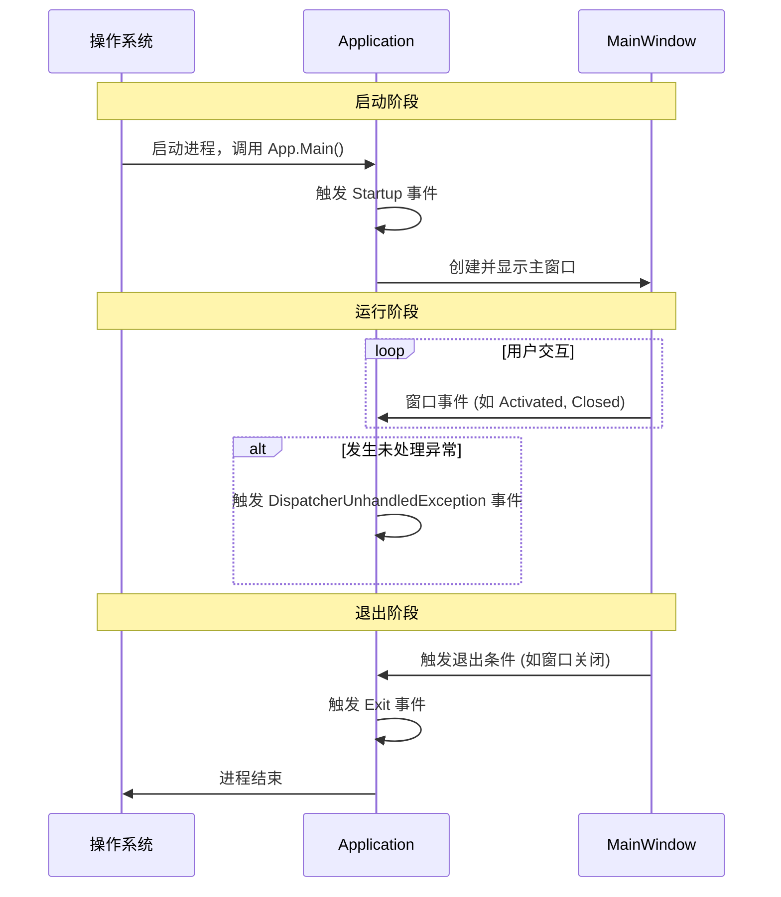
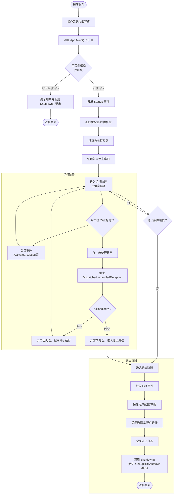
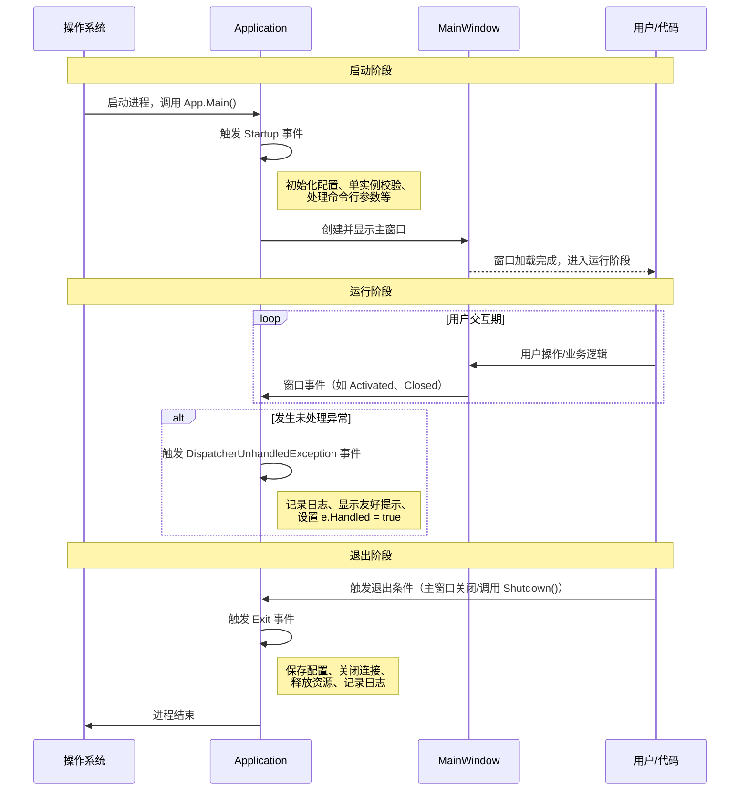
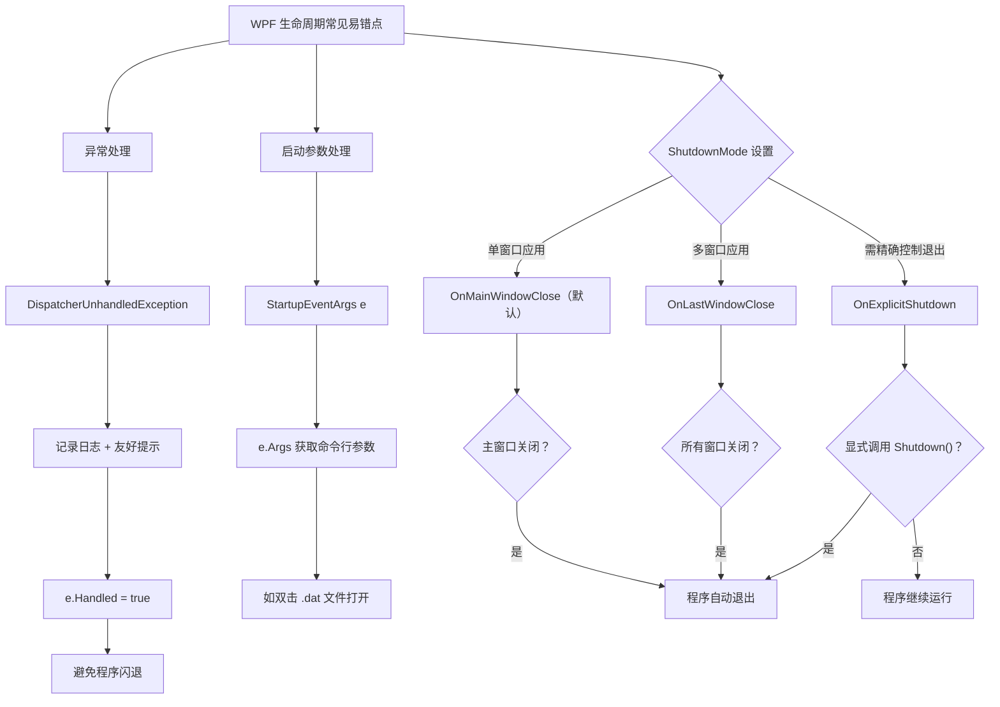

# 001001005_Application的生命周期																																																																																																																																																																																																																																												

## 文章摘要


WPF Application 生命周期涵盖**启动、运行、退出**三大核心阶段。启动阶段通过 `Startup` 事件进行单实例校验、权限检查和主窗口创建；运行阶段依靠 `DispatcherUnhandledException` 实现全局异常拦截，确保程序稳定不闪退；退出阶段通过 `Exit` 事件完成配置保存、数据库/硬件断开及日志记录。本文还对比了 `OnMainWindowClose`、`OnLastWindowClose`、`OnExplicitShutdown` 三种退出模式，并结合多窗口工业监控场景给出代码示例。规范的生命周期管理是构建健壮、可控的 WPF 工业应用程序的基础。
​	Application（应用程序类）的生命周期，就是 WPF 程序从「启动→运行→退出」的完整过程，核心分为 **启动、运行、退出** 三大阶段，每个阶段对应专属事件和操作逻辑。下面用 “人话” 讲清生命周期，再结合工业场景案例说明用法。


## 核心事件时序图（简明版）

为了直观展示 `Startup`、`DispatcherUnhandledException` 和 `Exit` 这三个核心事件在 WPF Application 生命周期中的触发时机与交互主体，下面提供一个简明的时序图：



**时序图解读：**
- **启动阶段**：操作系统启动程序后，`Application` 立即触发 `Startup` 事件，随后创建并显示 `MainWindow`。
- **运行阶段**：程序进入主消息循环，`MainWindow` 与 `Application` 交互窗口事件。若发生未处理异常，`Application` 会触发 `DispatcherUnhandledException` 事件进行最后拦截。
- **退出阶段**：当退出条件满足（如主窗口关闭），`Application` 触发 `Exit` 事件进行资源清理，最终进程结束。

此图聚焦于三个核心事件的触发顺序与主体，便于快速理解生命周期关键节点。

## 一、Application 生命周期核心阶段（3 步核心 + 关键事件）

### 1. 启动阶段（Startup）

- **通俗解释**：程序 “刚睡醒”，还没显示任何窗口，是初始化的最佳时机；
- **核心事件**：`Startup`（程序启动时触发，优先级高于 `StartupUri`）；
- **典型操作**：初始化配置、检查权限、处理命令行参数、创建主窗口、单实例校验（互斥锁）。

### 2. 运行阶段（Running）

- **通俗解释**：程序 “正常工作”，用户操作窗口 / 控件，是程序的核心运行期；
- **核心事件**：无专属 “运行事件”，但可监听全局异常（`DispatcherUnhandledException`）、窗口激活 / 关闭等；
- **典型操作**：管理窗口、共享全局数据、响应用户操作、处理业务逻辑。

### 3. 退出阶段（Exit）

- **通俗解释**：程序 “准备关机”，所有窗口关闭前的收尾阶段；
- **核心事件**：`Exit`（程序退出时触发）；
- **典型操作**：保存配置、关闭数据库连接、释放硬件资源、记录退出日志。

### 生命周期完整流程（可视化）





该流程图重新梳理并细化了 WPF Application 生命周期的完整流程：
1.  **明确的阶段划分**：使用子图清晰标出**运行阶段**和**退出阶段**，与文章核心结构对应。
2.  **完整的启动路径**：从程序启动、单实例校验到 `Startup` 事件触发及初始化操作，逻辑连贯。
3.  **详细的运行阶段循环**：展示了用户交互、窗口事件与业务逻辑的循环，并集成了**全局异常处理（DispatcherUnhandledException）** 的关键决策点（`e.Handled` 决定程序走向）。
4.  **整合退出触发**：将“退出条件触发？”作为运行阶段到退出阶段的桥梁，并涵盖了因未处理异常（`e.Handled = false`）导致的退出路径。
5.  **包含退出阶段操作**：在退出子图中，列出了 `Exit` 事件触发后的典型操作序列（保存、关闭、记录），并体现了 `Shutdown()` 调用（针对 `OnExplicitShutdown` 模式）。
此图旨在提供一个更全面、更贴近实际开发决策的可视化参考。### 核心事件时序图（Sequence Diagram）

为了更清晰地展示生命周期中关键事件的触发顺序和交互主体，下面使用 Mermaid 时序图进行描绘：



**时序图说明：**

1.  **启动阶段**：
    *   **进程启动**：操作系统启动 WPF 程序，调用 `App.Main()` 入口点。
    *   **Startup 事件**：`Application` 对象触发 `Startup` 事件。这是程序初始化的核心时机，通常在此进行配置加载、权限校验、单实例检查等操作。
    *   **创建主窗口**：在 `Startup` 事件处理程序中，创建并显示 `MainWindow`，程序界面呈现给用户。

2.  **运行阶段**：
    *   **用户交互**：程序进入主消息循环，`MainWindow` 响应用户操作（点击、输入等）并执行业务逻辑。
    *   **窗口事件**：`MainWindow` 的生命周期事件（如 `Activated`、`Closed`）会通知到 `Application`。
    *   **全局异常捕获**：如果在 UI 线程上发生未处理的异常，`Application` 会触发 `DispatcherUnhandledException` 事件。这是防止程序崩溃的最后防线，应在此记录日志并给用户友好提示。

3.  **退出阶段**：
    *   **退出触发**：退出条件被满足（例如主窗口关闭、代码调用 `Shutdown()`）。
    *   **Exit 事件**：`Application` 触发 `Exit` 事件。这是进行资源清理（如关闭数据库连接、释放硬件资源）、保存最终配置和记录退出日志的标准位置。
    *   **进程结束**：所有清理工作完成后，应用程序进程正式结束。

此时序图明确了 `Startup`、`DispatcherUnhandledException` 和 `Exit` 这三个关键事件在生命周期中的确切触发时机和执行主体，有助于开发者构建更健壮、可控的 WPF 应用程序。
## 二、核心生命周期案例（工业场景）

### 	案例 1：完整生命周期实现（含单实例 + 异常处理 + 资源清理）

​	这是工业软件（如数据采集系统）的标准生命周期实现，覆盖启动、运行、退出全流程：

csharp：

```c#
using System;
using System.Threading;
using System.Windows;

namespace IndustrialApp
{
    public partial class App : Application
    {
        // 1. 启动阶段：初始化+单实例校验
        private void App_Startup(object sender, StartupEventArgs e)
        {
            // 步骤1：单实例校验（互斥锁）
            bool isNewInstance;
            using (Mutex mutex = new Mutex(true, "com.mycompany.IndustrialApp_Mutex", out isNewInstance))
            {
                if (isNewInstance)
                {
                    // 步骤2：初始化全局配置（工业场景：加载设备参数）
                    GlobalConfig.Load("config.json");

                    // 步骤3：处理命令行参数（比如双击数据文件打开程序）
                    string targetFile = e.Args.Length > 0 ? e.Args[0] : null;

                    // 步骤4：创建并显示主窗口
                    MainWindow = new MainWindow(targetFile);
                    MainWindow.Show();
                }
                else
                {
                    // 重复实例：提示并退出
                    MessageBox.Show("数据采集系统已在运行！", "提示", 
                        MessageBoxButton.OK, MessageBoxImage.Information);
                    Shutdown(); // 退出当前实例
                }
            }
        }

        // 2. 运行阶段：全局异常捕获（防止程序闪退）
        private void App_DispatcherUnhandledException(object sender, System.Windows.Threading.DispatcherUnhandledExceptionEventArgs e)
        {
            // 工业场景：记录异常日志（方便排查设备通信问题）
            LogHelper.Error("程序运行异常", e.Exception);
            
            // 显示友好提示（不暴露技术细节）
            MessageBox.Show("数据采集异常，请检查设备连接！", "错误", 
                MessageBoxButton.OK, MessageBoxImage.Error);
            
            // 标记异常已处理，避免程序崩溃
            e.Handled = true;
        }

        // 3. 退出阶段：资源清理（工业场景必备）
        private void App_Exit(object sender, ExitEventArgs e)
        {
            // 步骤1：保存用户配置（比如窗口大小、采集参数）
            GlobalConfig.Save("config.json");

            // 步骤2：关闭硬件/数据库连接（工业场景：断开传感器/PLC连接）
            DeviceHelper.DisconnectAll();
            DbHelper.CloseConnection();

            // 步骤3：记录退出日志（审计用）
            LogHelper.Info($"程序正常退出，退出码：{e.ApplicationExitCode}");
        }
    }
}
```

#### 配套 App.xaml 配置（绑定事件）

xaml:

```
<Application x:Class="IndustrialApp.App"
             xmlns="http://schemas.microsoft.com/winfx/2006/xaml/presentation"
             xmlns:x="http://schemas.microsoft.com/winfx/2006/xaml"
             Startup="App_Startup"
             Exit="App_Exit"
             DispatcherUnhandledException="App_DispatcherUnhandledException">
    <Application.Resources>
        <!-- 全局资源 -->
    </Application.Resources>
</Application>
```

### 案例 2：启动阶段动态选择主窗口（按权限）

​	工业软件常按用户权限显示不同主窗口（比如管理员 / 普通操作员）：

csharp:

```
private void App_Startup(object sender, StartupEventArgs e)
{
    // 步骤1：校验用户权限（模拟从配置读取）
    string userRole = ConfigHelper.GetUserRole(); // "Admin" 或 "Operator"

    // 步骤2：按权限创建不同主窗口
    if (userRole == "Admin")
    {
        MainWindow = new AdminMainWindow(); // 管理员窗口（含配置/权限管理）
    }
    else
    {
        MainWindow = new OperatorMainWindow(); // 操作员窗口（仅数据采集）
    }

    // 步骤3：显示主窗口
    MainWindow.Show();
}
```

### 案例 3：退出阶段确认是否保存数据

​	工业软件退出前，确认用户是否保存未提交的采集数据：

csharp:

```c#
private void App_Exit(object sender, ExitEventArgs e)
{
    // 步骤1：检查是否有未保存数据
    if (DataCollector.HasUnsavedData)
    {
        // 步骤2：弹出确认框
        MessageBoxResult result = MessageBox.Show("有未保存的采集数据，是否保存？", "提示",
            MessageBoxButton.YesNoCancel, MessageBoxImage.Question);

        // 步骤3：根据选择处理
        if (result == MessageBoxResult.Yes)
        {
            DataCollector.SaveUnsavedData(); // 保存数据
        }
        else if (result == MessageBoxResult.Cancel)
        {
            e.ApplicationExitCode = -1; // 标记退出取消
            ShutdownMode = ShutdownMode.OnExplicitShutdown; // 取消退出
        }
    }

    // 步骤4：通用清理
    DeviceHelper.DisconnectAll();
}
```

## 三、关键补充（生命周期易错点）

1. **ShutdownMode（退出触发规则）**：

   - 默认：`ShutdownMode.OnMainWindowClose`（主窗口关闭则退出程序）；
   - 常用配置：`ShutdownMode.OnExplicitShutdown`（仅调用 `Shutdown()` 才退出，适合多窗口场景）。

   

   csharp:

   ```c#
   // 在Startup事件中设置
   ShutdownMode = ShutdownMode.OnExplicitShutdown;
   ```

2. **异常退出处理**：

   程序崩溃时，

   ```c#
   DispatcherUnhandledException
   ```

    是最后一道防线，需记录日志并友好提示，避免直接闪退。

3. **启动参数（StartupEventArgs e）**：

   ```c#
   e.Args
   ```

    可获取命令行参数（比如用户双击 

   ```c#
   .dat
   ```

    文件打开程序，参数为文件路径）。




## 四、生命周期模式对比

WPF Application 的退出行为由 `ShutdownMode` 属性控制，它决定了程序何时结束。下表对比三种模式，帮助你在不同场景下做出选择。

| 模式名称 | 触发条件 | 适用场景 | 代码设置示例 |
| :--- | :--- | :--- | :--- |
| **OnMainWindowClose**（默认） | 主窗口（`MainWindow`）关闭时，程序自动退出。 | 单窗口应用、主窗口即程序唯一界面的场景。 | `ShutdownMode = ShutdownMode.OnMainWindowClose;` |
| **OnLastWindowClose** | 最后一个窗口关闭时，程序自动退出。 | 多窗口应用（如文档编辑器、多标签页工具），希望所有窗口都关闭后才退出。 | `ShutdownMode = ShutdownMode.OnLastWindowClose;` |
| **OnExplicitShutdown** | 只有显式调用 `Application.Current.Shutdown()` 或 `App.Shutdown()` 时，程序才会退出。 | 需要精确控制退出时机的场景，例如：后台服务窗口、需要用户确认保存的多窗口系统、工业监控系统。 | `ShutdownMode = ShutdownMode.OnExplicitShutdown;` |

**工业场景选择建议（以多窗口数据监控系统为例）**

在工业数据监控系统中，通常存在多个独立窗口（如主监控面板、实时曲线图、报警日志窗口、设备配置窗口）。如果使用默认的 `OnMainWindowClose`，关闭主监控面板就会导致整个程序退出，其他窗口被迫关闭，可能丢失未保存的配置或实时数据。

因此，推荐采用 **`OnExplicitShutdown`** 模式：
1.  **启动时设置**：在 `App_Startup` 中设置 `ShutdownMode = ShutdownMode.OnExplicitShutdown;`。
2.  **退出控制**：在用户点击“退出”菜单或最后一个窗口关闭时，统一检查所有子窗口状态，确认数据已保存、设备连接已安全断开后，再调用 `Shutdown()` 退出程序。
3.  **容错处理**：结合 `Exit` 事件进行最终的资源清理和日志记录，确保即使异常退出也能安全释放资源。

这种模式将退出主动权完全交给程序逻辑，避免了因用户误关某个窗口而导致整个系统意外终止，符合工业软件对稳定性和可控性的高要求。


**OnLastWindowClose 模式代码示例**

适用场景：多窗口文档编辑器，所有窗口关闭后程序自动退出。

csharp:

```csharp
public partial class App : Application
{
    public App()
    {
        // 设置为最后一个窗口关闭时退出
        ShutdownMode = ShutdownMode.OnLastWindowClose;
    }

    private void App_Startup(object sender, StartupEventArgs e)
    {
        // 打开多个文档窗口
        var window1 = new DocumentWindow("文档1");
        window1.Show();

        var window2 = new DocumentWindow("文档2");
        window2.Show();

        // 无需手动调用 Shutdown()，所有窗口关闭后自动退出
    }
}
```

**OnExplicitShutdown 模式代码示例**

适用场景：工业监控系统，需要精确控制退出时机。

csharp:

```csharp
public partial class App : Application
{
    private void App_Startup(object sender, StartupEventArgs e)
    {
        // 设置为只有显式调用 Shutdown() 才退出
        ShutdownMode = ShutdownMode.OnExplicitShutdown;

        // 打开多个监控子窗口
        var mainPanel = new MonitorMainPanel();
        mainPanel.Show();

        var realtimeChart = new RealtimeChartWindow();
        realtimeChart.Show();

        var alarmLog = new AlarmLogWindow();
        alarmLog.Show();
    }

    /// 全局退出方法（由菜单"退出系统"或退出按钮调用）
    public static void ExitApplication()
    {
        // 步骤1：检查所有子窗口状态
        if (MonitorMainPanel.HasUnsavedConfig)
        {
            var result = MessageBox.Show("有未保存的配置，确定退出？", "确认",
                MessageBoxButton.YesNo, MessageBoxImage.Warning);
            if (result == MessageBoxResult.No) return;
        }

        // 步骤2：确认所有窗口可安全关闭后，显式调用 Shutdown()
        Application.Current.Shutdown();
    }
}
```

> 以上示例展示了两种模式的典型设置方式和 `Shutdown()` 调用场景：`OnLastWindowClose` 无需手动调用 `Shutdown()`，所有窗口关闭时自动退出；`OnExplicitShutdown` 则需要通过菜单或按钮等入口显式调用 `Shutdown()`，将退出控制权完全交给程序逻辑。

## 总结

### 生命周期核心要点

1. **启动阶段（Startup）**：初始化 + 校验 + 创建窗口，是程序 “开局准备”；
2. **运行阶段**：无专属事件，核心是窗口管理和业务逻辑，是程序 “核心工作期”；
3. **退出阶段（Exit）**：清理资源 + 保存数据，是程序 “收尾工作”；
4. **全局异常（DispatcherUnhandledException）**：运行阶段的 “安全兜底”，工业软件必须实现。

### 工业场景价值

​	规范的生命周期管理，能保证程序启动稳定（单实例、权限校验）、运行可靠（异常捕获）、退出安全（资源清理），是工业级 WPF 程序的基础要求。


## 关键词

WPF, Application 生命周期, Startup, Exit, DispatcherUnhandledException, ShutdownMode, 工业软件, 资源管理
