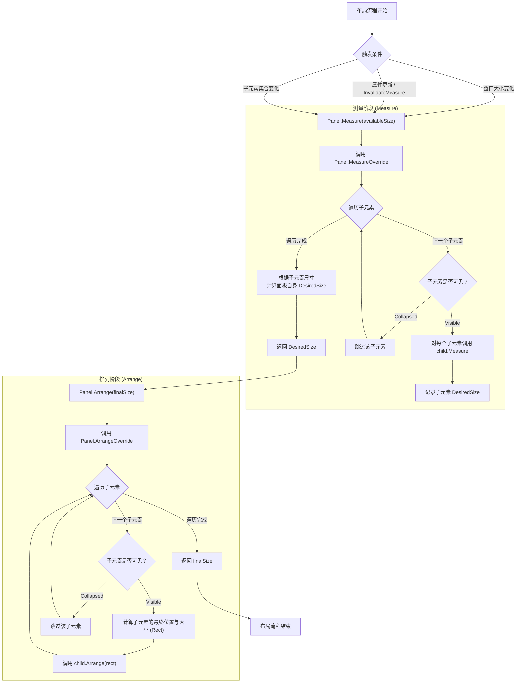

# 003001001_布局控件


> **摘要**：本文系统梳理 WPF 布局控件的核心体系——从抽象基类 `Panel` 的“Measure-Arrange”两阶段布局模型出发，逐一详解 Grid、StackPanel、Canvas、DockPanel、WrapPanel 五大基础面板及 UniformGrid、VirtualizingStackPanel 等进阶面板的用法、属性与适用场景，并给出布局面板选择原则与自定义 Panel 实战示例，帮助开发者快速建立“按场景选面板”的布局思维。
WPF 的布局系统以其“声明式、响应式”特性为核心，而**布局控件（布局面板）**是实现 UI 元素排列的核心载体——所有布局控件都基于统一的基类构建，不同面板通过差异化的“测量-排列”逻辑，适配不同的 UI 布局场景（如网格、线性堆叠、绝对定位、流式换行等）。

## 一、WPF 布局控件的核心基类：Panel 类

### 1. Panel 类的官方定义与定位

`Panel`（命名空间：`System.Windows.Controls.Panel`）是 WPF 所有布局控件的**抽象基类**，它继承自 `FrameworkElement`，核心职责是：
> 为子元素提供统一的 “测量（Measure）- 排列（Arrange）” 布局框架，管理子元素集合，并实现不同的布局逻辑（如网格、堆叠、停靠）。

### 2. Panel 类的继承关系（WPF UI 体系定位）

```markdown
System.Object
└─ System.Windows.Threading.DispatcherObject （线程门禁）
   └─ System.Windows.DependencyObject （依赖属性管理）
      └─ System.Windows.Media.Visual （视觉渲染）
         └─ System.Windows.UIElement （布局+交互基础）
            └─ System.Windows.FrameworkElement （业务级UI能力）
               └─ System.Windows.Controls.Panel （布局控件基类，抽象）
                  └─ 具体布局面板（Grid、StackPanel、Canvas等）
```

### 3. Panel 类的核心特性

| 特性         | 说明                                                         |
| :----------- | :----------------------------------------------------------- |
| 抽象性       | 无法直接实例化（`new Panel()` 报错），必须使用其派生类或自定义继承； |
| 子元素管理   | 包含`Children`属性（`UIElementCollection`），用于添加/移除/管理子 UI 元素； |
| 布局核心逻辑 | 重写 `FrameworkElement`/`UIElement` 的 `MeasureOverride`（测量子元素）和 `ArrangeOverride`（排列子元素）方法 —— 这是不同布局面板的核心差异点； |
| 附加属性支持 | 定义/使用附加属性（如 `Grid.Row`、`Canvas.Left`），用于指定子元素的布局位置； |
| 响应式基础   | 当父容器大小变化时，自动触发子元素的重新测量和排列，实现响应式布局； |

### 4. Panel 类的核心方法（布局的底层逻辑）

所有布局面板的差异本质是重写这两个方法：
| 方法                                  | 作用                                                         |
| :------------------------------------ | :----------------------------------------------------------- |
| `MeasureOverride(Size availableSize)` | 测量阶段：计算所有子元素的“期望尺寸”（DesiredSize），确定面板自身的最小所需尺寸； |
| `ArrangeOverride(Size finalSize)`     | 排列阶段：根据测量结果，为每个子元素分配最终的位置和大小（Rect），完成布局； |


整个布局流程可以用下面的 Mermaid 流程图来梳理——从父容器触发更新，到 Panel 测量、确定尺寸，再到最终排列，一目了然：




## 二、WPF 布局控件的种类与作用

布局控件分为「基础常用面板」（覆盖 90% 日常场景）、「特殊进阶面板」（专用场景）、「自定义面板」（扩展场景）三类，以下逐一详解：
### 1. 基础常用布局面板（日常开发核心）

#### （1）Grid（网格面板）—— 最常用的复杂布局面板

- **核心作用**：按 “行 + 列” 的二维网格排列子元素，类似 Excel 表格 / HTML 的 Table，支持行高 / 列宽的灵活配置（固定值、比例、自适应）；

- **布局规则**：

  1. 先通过 `RowDefinitions`/`ColumnDefinitions` 定义行 / 列；
  2. 子元素通过 `Grid.Row`/`Grid.Column` 附加属性指定所在行 / 列（索引从 0 开始）；
  3. 支持跨行 / 跨列（`Grid.RowSpan`/`Grid.ColumnSpan`）；

  

- **核心属性**：

  | 属性 / 附加属性                      | 作用                                                         |
  | :----------------------------------- | :----------------------------------------------------------- |
  | `RowDefinitions`/`ColumnDefinitions` | 定义行 / 列集合（如 `<RowDefinition Height="50"/>`）；        |
  | `Grid.Row`/`Grid.Column`             | 子元素的行 / 列索引；                                        |
  | `Grid.RowSpan`/`Grid.ColumnSpan`     | 子元素跨行 / 跨列数；                                        |
  | 行 / 列的`Height`/`Width`            | 支持三种值：① 固定值（如 `50`/`50px`）：固定大小；② 比例（如 `2*`）：按比例分配空间；③ `Auto`：自适应子元素内容大小； |

- **适用场景：复杂 UI 布局（表单、后台管理界面、多区域分割的界面、需要对齐的元素组）；**

- **示例**：

XAML：

```xaml
<!-- 2行2列的Grid，按钮跨2列，文本框自适应 -->
<Grid Width="300" Height="200" ShowGridLines="True">
    <Grid.RowDefinitions>
        <RowDefinition Height="Auto"/> <!-- 自适应行高 -->
        <RowDefinition Height="*"/>    <!-- 剩余空间全占 -->
    </Grid.RowDefinitions>
    <Grid.ColumnDefinitions>
        <ColumnDefinition Width="100"/> <!-- 固定列宽 -->
        <ColumnDefinition Width="*"/>    <!-- 剩余空间全占 -->
    </Grid.ColumnDefinitions>

    <!-- 按钮：第0行，跨2列 -->
    <Button Content="提交" Grid.Row="0" Grid.ColumnSpan="2" Margin="5"/>
    <!-- 标签：第1行第0列 -->
    <TextBlock Text="姓名：" Grid.Row="1" Grid.Column="0" VerticalAlignment="Center"/>
    <!-- 文本框：第1行第1列 -->
    <TextBox Grid.Row="1" Grid.Column="1" Margin="5"/>
</Grid>
```

#### （2）StackPanel（栈面板）—— 简单线性布局面板

- **核心作用**：按“水平 / 垂直”方向线性堆叠子元素，子元素默认拉伸填满对应方向（如垂直布局时宽度拉伸，高度自适应）；

- **布局规则**：

  1. 通过 `Orientation` 指定布局方向（默认 `Vertical` 垂直，可选 `Horizontal` 水平）；
  2. 子元素按添加顺序排列，超出面板范围的部分会被裁剪；

  

- **核心属性**：

  | 属性                                      | 作用                                    |
  | :---------------------------------------- | :-------------------------------------- |
  | `Orientation`                             | 布局方向（`Vertical`/`Horizontal`）；   |
  | `HorizontalAlignment`/`VerticalAlignment` | 面板自身在父容器的对齐方式；            |
  | `Margin`                                  | 子元素间距（如 `5` 表示上下左右各 5px）； |

  

- **适用场景：简单线性布局（按钮组、单列 / 单行表单、列表项、导航栏的菜单项）；**

- **示例**：

XAML：

```xaml
<!-- 垂直堆叠的按钮组 -->
<StackPanel Orientation="Vertical" Margin="10" Spacing="5">
    <Button Content="按钮1" Width="100"/>
    <Button Content="按钮2" Width="100"/>
    <Button Content="按钮3" Width="100"/>
</StackPanel>
```

#### （3）Canvas（画布面板）—— 绝对坐标布局面板

- **核心作用**：按“绝对坐标”定位子元素，子元素位置由 `Canvas.Left`/`Canvas.Top`（或 `Right`/`Bottom`）指定，不随父容器大小变化；

- **布局规则**：

  1. 子元素位置是固定的绝对坐标（相对于 Canvas 的左上角）；
  2. 可通过 `Canvas.ZIndex` 设置子元素的层级（值越大越在上层）；
  3. 超出 Canvas 范围的部分默认不裁剪（可通过 `ClipToBounds="True"` 开启裁剪）；

  

- **核心附加属性**：

  | 属性                           | 作用                                           |
  | :----------------------------- | :--------------------------------------------- |
  | `Canvas.Left`/`Canvas.Top`     | 子元素左上角到 Canvas 左 / 上边缘的距离；      |
  | `Canvas.Right`/`Canvas.Bottom` | 子元素右下角到 Canvas 右 / 下边缘的距离；      |
  | `Canvas.ZIndex`                | 子元素的显示层级（默认 0，值大的覆盖值小的）； |

  

- **适用场景**：固定位置的 UI（绘图板、游戏界面、自定义图形布局、仪表盘的指针 / 刻度）；

- **示例**：

XAML：

```xaml
<!-- 绝对定位的圆形和文字 -->
<Canvas Width="200" Height="200" Background="LightGray">
    <!-- 圆形：左上角(50,50) -->
    <Ellipse Width="100" Height="100" Canvas.Left="50" Canvas.Top="50" Fill="LightBlue"/>
    <!-- 文字：左上角(80,90)，层级高于圆形 -->
    <TextBlock Text="Canvas" Canvas.Left="80" Canvas.Top="90" Canvas.ZIndex="1" FontSize="16"/>
</Canvas>
```

#### （4）DockPanel（停靠面板）—— 边缘停靠布局面板

- **核心作用**：将子元素“停靠”到面板的上 / 下 / 左 / 右边缘，最后一个子元素默认填充剩余空间；

- **布局规则**：

  1. 子元素通过 `DockPanel.Dock` 指定停靠方向（`Top`/`Bottom`/`Left`/`Right`）；
  2. 按子元素添加顺序处理，后添加的元素不会覆盖先停靠的元素；
  3. `LastChildFill="True"`（默认）时，最后一个子元素填充剩余空间；

  

- **核心属性 / 附加属性**：

  | 属性             | 作用                                            |
  | :--------------- | :---------------------------------------------- |
  | `DockPanel.Dock` | 子元素的停靠方向；                              |
  | `LastChildFill`  | 是否让最后一个子元素填充剩余空间（默认 True）； |

  

- **适用场景**：界面分区布局（顶部导航栏、底部状态栏、左侧菜单栏 + 右侧内容区）；

- **示例**：

XAML：

```xaml
<!-- 顶部导航+左侧菜单+右侧内容 -->
<DockPanel Width="400" Height="300" LastChildFill="True">
    <!-- 顶部停靠：导航栏 -->
    <TextBlock Text="顶部导航栏" DockPanel.Dock="Top" Height="30" Background="LightBlue" TextAlignment="Center"/>
    <!-- 左侧停靠：菜单栏 -->
    <TextBlock Text="左侧菜单" DockPanel.Dock="Left" Width="100" Background="LightGreen" TextAlignment="Center"/>
    <!-- 最后一个元素：填充剩余空间（内容区） -->
    <TextBlock Text="主内容区" Background="White" TextAlignment="Center" VerticalAlignment="Center"/>
</DockPanel>
```

#### （5）WrapPanel（换行面板）—— 流式换行布局面板

- **核心作用**：按“水平 / 垂直”方向堆叠子元素，当一行 / 一列空间不足时，自动换行 / 换列；

- **布局规则**：

  1. 类似 `StackPanel`，但支持自动换行；
  2. 子元素大小默认自适应内容，不会被拉伸；
  3. 可通过 `ItemWidth`/`ItemHeight` 统一设置子元素大小；

  

- **核心属性**：

  | 属性                     | 作用                                                   |
  | :----------------------- | :----------------------------------------------------- |
  | `Orientation`            | 布局方向（默认 `Horizontal` 水平，可选 `Vertical` 垂直）； |
  | `ItemWidth`/`ItemHeight` | 统一设置所有子元素的宽度 / 高度；                      |
  | `Spacing`                | 子元素之间的间距（WPF 4.5 + 支持）；                   |

  

- **适用场景**：流式布局（标签云、图片墙、数量不固定的按钮组、商品列表）；

- **示例**：

XAML：

```xaml
<!-- 水平流式换行的标签云 -->
<WrapPanel Width="300" Height="200" Orientation="Horizontal" Spacing="5" Margin="10">
    <Border Background="LightBlue" Padding="5" CornerRadius="3">标签1</Border>
    <Border Background="LightGreen" Padding="5" CornerRadius="3">标签2</Border>
    <Border Background="LightPink" Padding="5" CornerRadius="3">标签3</Border>
    <Border Background="LightYellow" Padding="5" CornerRadius="3">标签4</Border>
    <Border Background="LightGray" Padding="5" CornerRadius="3">标签5</Border>
</WrapPanel>
```

### 2. 特殊进阶布局面板（专用场景）

#### （1）UniformGrid（均匀网格面板）

- **核心作用**：自动将子元素排列成“等大小单元格”的网格，无需手动定义行 / 列，所有单元格尺寸完全相同；

- **布局规则**：

  1. 可通过 `Rows`/`Columns` 指定固定行数 / 列数，若不指定则自动按子元素数量均分；
  2. 子元素按添加顺序填充，自动换行；

  

- **核心属性**：

  | 属性                     | 作用                                       |
  | :----------------------- | :----------------------------------------- |
  | `Rows`/`Columns`         | 固定行数 / 列数（如 `Rows="3"` 表示 3 行）； |
  | `FirstRow`/`FirstColumn` | 起始行 / 列索引（默认 0）；                |

  

- **适用场景**：等大小元素的网格布局（计算器按键、九宫格、图标网格、棋盘）；

- **示例**：

XAML：

```xaml
<!-- 3行3列的均匀网格（九宫格） -->
<UniformGrid Rows="3" Columns="3" Width="300" Height="300" ShowGridLines="True">
    <Button Content="1"/>
    <Button Content="2"/>
    <Button Content="3"/>
    <Button Content="4"/>
    <Button Content="5"/>
    <Button Content="6"/>
    <Button Content="7"/>
    <Button Content="8"/>
    <Button Content="9"/>
</UniformGrid>
```

#### （2）VirtualizingStackPanel（虚拟化栈面板）

- **核心作用**：继承自`StackPanel`，新增 “UI 虚拟化” 能力 —— 仅渲染可视区域内的子元素（如 `ListBox` 中只显示屏幕内的 10 项，而非 10000 项），大幅提升大量数据的渲染性能；

- **核心特性**：

  1. 是 `ListBox`/`ListView`/`DataGrid` 的默认布局面板；
  2. 支持 `VirtualizationMode`（`Standard`：销毁不可见元素；`Recycling`：复用不可见元素，性能更高）；

  

- **适用场景**：大数据列表（如 10000+ 条数据的列表展示）；

- **示例**：

XAML：

```xaml
<!-- ListBox使用VirtualizingStackPanel渲染10000条数据 -->
<ListBox Width="200" Height="300">
    <ListBox.ItemsPanel>
        <ItemsPanelTemplate>
            <VirtualizingStackPanel VirtualizationMode="Recycling"/>
        </ItemsPanelTemplate>
    </ListBox.ItemsPanel>
    <!-- 绑定10000条数据 -->
    <ListBox.ItemsSource>
        <x:Array Type="{x:Type sys:String}">
            <!-- 模拟10000条数据 -->
            <sys:String>数据项1</sys:String>
            <sys:String>数据项2</sys:String>
            <!-- ... 省略9998项 ... -->
        </x:Array>
    </ListBox.ItemsSource>
</ListBox>
```

#### （3）专用布局面板（无需手动使用）

这类面板是 WPF 内置控件的“专用布局容器”，无需开发者手动实例化，仅作为内置控件的一部分工作：
| 面板名称        | 专用控件     | 作用                                                    |
| :-------------- | :----------- | :------------------------------------------------------ |
| `TabPanel`      | `TabControl` | 排列 TabControl 的选项卡头，支持横向/纵向、溢出滚动； |
| `ToolBarPanel`  | `ToolBar`    | 排列工具栏按钮，支持自动换行、溢出时显示下拉菜单；      |
| `MenuItemPanel` | `MenuItem`   | 排列菜单项的子项，支持横向/纵向布局；                 |

### 3. 自定义布局面板（扩展场景）

​	当基础面板无法满足特殊布局需求（如瀑布流、环形布局、响应式布局）时，可继承 `Panel` 类实现自定义布局，核心是重写 `MeasureOverride` 和 `ArrangeOverride`。

#### 示例：简单的瀑布流布局面板（简化版）

C#：

```c#
// 自定义瀑布流面板（按列排列，高度自适应）
public class WaterfallPanel : Panel
{
    // 附加属性：指定子元素的列索引
    public static readonly DependencyProperty ColumnIndexProperty =
        DependencyProperty.RegisterAttached("ColumnIndex", typeof(int), typeof(WaterfallPanel), new PropertyMetadata(0));

    public static void SetColumnIndex(UIElement element, int value) => element.SetValue(ColumnIndexProperty, value);
    public static int GetColumnIndex(UIElement element) => (int)element.GetValue(ColumnIndexProperty);

    // 列数（依赖属性）
    public int ColumnCount
    {
        get => (int)GetValue(ColumnCountProperty);
        set => SetValue(ColumnCountProperty, value);
    }
    public static readonly DependencyProperty ColumnCountProperty =
        DependencyProperty.Register("ColumnCount", typeof(int), typeof(WaterfallPanel), new PropertyMetadata(2, OnColumnCountChanged));

    private static void OnColumnCountChanged(DependencyObject d, DependencyPropertyChangedEventArgs e)
    {
        ((WaterfallPanel)d).InvalidateMeasure(); // 列数变化，重新测量
    }

    // 测量阶段：计算每列的高度，确定面板总尺寸
    protected override Size MeasureOverride(Size availableSize)
    {
        // 初始化每列的高度
        double[] columnHeights = new double[ColumnCount];
        for (int i = 0; i < ColumnCount; i++) columnHeights[i] = 0;

        // 测量每个子元素
        foreach (UIElement child in Children)
        {
            if (child.Visibility == Visibility.Collapsed) continue;
            
            // 让子元素测量自己的期望尺寸
            child.Measure(availableSize);
            Size childDesired = child.DesiredSize;

            // 找到当前最矮的列
            int minColumn = 0;
            for (int i = 1; i < ColumnCount; i++)
            {
                if (columnHeights[i] < columnHeights[minColumn]) minColumn = i;
            }

            // 记录列高度
            SetColumnIndex(child, minColumn);
            columnHeights[minColumn] += childDesired.Height;
        }

        // 面板的总宽度=可用宽度，总高度=最高列的高度
        double totalWidth = availableSize.Width;
        double totalHeight = columnHeights.Max();
        return new Size(totalWidth, totalHeight);
    }

    // 排列阶段：确定每个子元素的最终位置
    protected override Size ArrangeOverride(Size finalSize)
    {
        // 初始化每列的顶部位置
        double[] columnTop = new double[ColumnCount];
        double columnWidth = finalSize.Width / ColumnCount;

        foreach (UIElement child in Children)
        {
            if (child.Visibility == Visibility.Collapsed) continue;
            
            // 获取子元素的列索引
            int columnIndex = GetColumnIndex(child);
            // 计算子元素的位置和大小
            Rect arrangeRect = new Rect(
                columnIndex * columnWidth, // 左坐标
                columnTop[columnIndex],    // 上坐标
                columnWidth,               // 宽度
                child.DesiredSize.Height   // 高度
            );
            // 排列子元素
            child.Arrange(arrangeRect);
            // 更新列的顶部位置
            columnTop[columnIndex] += child.DesiredSize.Height;
        }

        return finalSize;
    }
}
```

**使用示例**：

XAML：

```xaml
<!-- 瀑布流面板：2列，展示不同高度的图片 -->
<local:WaterfallPanel ColumnCount="2" Width="400" Height="400">
    <Image Source="image1.jpg" Height="100" Stretch="UniformToFill"/>
    <Image Source="image2.jpg" Height="150" Stretch="UniformToFill"/>
    <Image Source="image3.jpg" Height="80" Stretch="UniformToFill"/>
    <Image Source="image4.jpg" Height="120" Stretch="UniformToFill"/>
</local:WaterfallPanel>
```


### 使用说明与注意事项

#### 1. 在项目中使用自定义面板的步骤

① **定义命名空间**：将自定义面板类（如 `WaterfallPanel`）放在项目的某个命名空间下（例如 `MyApp.Controls`），确保该类为 `public`。

② **在 XAML 中引用命名空间**：在需要使用该面板的 XAML 文件顶部添加命名空间映射，前缀可自定义（常用 `local` 或 `controls`）：
```xaml
<Window x:Class="MyApp.MainWindow"
        xmlns="http://schemas.microsoft.com/winfx/2006/xaml/presentation"
        xmlns:x="http://schemas.microsoft.com/winfx/2006/xaml"
        xmlns:local="clr-namespace:MyApp.Controls"
        ...>
```

③ **在 XAML 中使用自定义面板**：直接以映射前缀引用面板类名，如 `<local:WaterfallPanel ...>`（如前面示例所示）。

#### 2. 常见问题与解决方案

**问题 1：子元素运行时动态改变尺寸（如图片加载完成后高度变化），但面板未自动重新排列**

- **原因**：子元素的尺寸变化不会自动触发父面板的重新测量，除非子元素显式调用 `InvalidateMeasure()`。
- **解决方案**：
  - **方案 A（推荐）**：在子元素的 `SizeChanged` 事件中调用父面板的 `InvalidateMeasure()`，强制面板重新进行测量与排列。
  - **方案 B**：在 `WaterfallPanel` 中重写 `OnVisualChildrenChanged`，为每个新增子元素注册 `FrameworkElement.SizeChanged` 事件，事件处理中调用 `InvalidateMeasure()` 或 `InvalidateArrange()`。

**问题 2：运行时动态修改 `ColumnCount`（列数）后，面板布局未正确更新**

- **原因**：示例代码中的 `OnColumnCountChanged` 回调已经调用了 `InvalidateMeasure()`，理论上是有效的。但如果修改列数的同时子元素集合（`Children`）未变化，可能仍需强制重新排列。
- **解决方案**：确保在 `ColumnCount` 的 `PropertyChangedCallback` 中同时调用 `InvalidateMeasure()` 和 `InvalidateArrange()`，或在必要时调用 `InvalidateVisual()`。若仍不更新，可在设置新列数后手动调用 `panel.InvalidateMeasure()`。

**问题 3：面板宽高变化（如窗口缩放）时，自定义面板的布局自适应问题**

- **说明**：WPF 布局系统会自动调用 `MeasureOverride` 和 `ArrangeOverride` 响应尺寸变化。但若 `MeasureOverride` 中未正确使用 `availableSize`（例如固定返回某个尺寸），可能导致自适应失败。
- **建议**：在 `MeasureOverride` 中，应根据 `availableSize` 计算面板所需尺寸，而不是返回固定值。示例中的 `return new Size(availableSize.Width, totalHeight);` 已经正确处理了宽度自适应，但需注意 `availableSize.Width` 可能为 `double.PositiveInfinity`（当父容器不限制宽度时），此时应使用子元素期望宽度或设置一个合理的默认宽度。

**问题 4：子元素数量较多时（>200），自定义面板性能下降**

- **建议**：继承 `Panel` 的自定义面板默认不具备虚拟化能力，每个子元素都会被测量和排列。对于大数据量场景，建议考虑以下优化：
  - 限制一次加载的子元素数量（分页或按需加载）；
  - 结合 `VirtualizingPanel`（继承自它而非 `Panel`）实现虚拟化；
  - 在 `MeasureOverride` 中优先处理 `Visibility.Collapsed` 的子元素，跳过测量；
  - 使用 `CacheMode` 等渲染优化手段减少重绘开销。
## 三、布局面板的选择原则（新手必看）

| 布局场景                             | 推荐面板                 | 核心原因                                          |
| :----------------------------------- | :----------------------- | :------------------------------------------------ |
| *复杂 UI、行 / 列对齐、表单*         | *Grid*                   | *支持二维网格，行 / 列大小灵活配置，适配性最强；* |
| *简单线性排列（按钮组、单列表单）*   | *StackPanel*             | *代码最简，无需复杂配置；*                        |
| *固定位置（绘图、游戏、自定义图形）* | *Canvas*                 | *绝对坐标，精准控制位置；*                        |
| *边缘停靠（导航栏、状态栏、侧边栏）* | *DockPanel*              | *一键实现边缘停靠，剩余空间自动填充；*            |
| *流式换行（标签云、图片墙）*         | *WrapPanel*              | *自动换行，适配不同数量的子元素；*                |
| *等大小网格（计算器、九宫格）*       | *UniformGrid*            | *无需定义行 / 列，自动均分空间；*                 |
| *大数据列表（1000 + 项）*            | *VirtualizingStackPanel* | *UI 虚拟化，大幅提升性能；*                       |
| *特殊布局（瀑布流、环形）*           | *自定义 Panel*           | *继承 Panel 重写布局逻辑；*                       |


## 四、布局常见问题与调试技巧

WPF 布局看似声明式、自动化，但实际开发中仍有不少容易“踩坑”的地方。本节梳理最常遇到的 3 个布局陷阱，分析原因并给出解决方案，同时介绍两条立即可用的调试技巧，帮助你在几分钟内定位问题。

### 1. 常见布局陷阱与解决方案

#### 陷阱 1：Grid 的 `Auto` 行高/列宽计算“归零”

**现象**：`RowDefinition Height="Auto"` 的行里明明放了控件，但运行时该行高度为 0，控件不可见。

**原因**：WPF 的 Auto 行/列高度完全由子元素的 `DesiredSize` 决定，而 `DesiredSize` 又受子元素的 `VerticalAlignment`、`Visibility` 等因素影响。如果行内所有子元素都设置为 `VerticalAlignment="Top"` 且自身无固定高度，或存在 `Visibility.Collapsed`，Measure 阶段可能返回高度为 0。

**解决方案**：  
- 给该行添加 `MinHeight` 作为保底高度。  
- 确保至少有一个子元素能产生有效高度（如设置 `MinHeight` 或固定 `Height`）。  
- 用临时背景色或 `ShowGridLines` 检查该行的实际渲染区域。

```xaml
<!-- 容易“消失”的行 -->
<Grid>
    <Grid.RowDefinitions>
        <RowDefinition Height="Auto"/>   <!-- 可能为 0 -->
        <RowDefinition Height="*"/>
    </Grid.RowDefinitions>
    <TextBlock Grid.Row="0" Text="这行可能看不到"
               VerticalAlignment="Top" /> <!-- 无实际高度 -->
</Grid>

<!-- 修复：添加 MinHeight 或让元素拥有自然高度 -->
<RowDefinition Height="Auto" MinHeight="24"/>
```

#### 陷阱 2：Canvas 子元素超出边界“消失”或意外可见

**现象**：Canvas 上的某个元素明明设置了坐标，却看不到，或者相反——坐标已经超出 Canvas 范围，内容却仍显示在外面。

**原因**：Canvas 默认 `ClipToBounds="False"`，子元素即使坐标超出面板边界也会渲染，这在绘图场景是优点，但在精确布局中可能造成“元素跑到外面”的困扰；反之若显式设置 `ClipToBounds="True"`，超出部分会被裁剪，可能误以为元素丢失。

**解决方案**：  
- 需要精确裁剪时设置 `ClipToBounds="True"`；  
- 需要确保内容始终可见时，用 `ScrollViewer` 包裹 Canvas，而非依赖不裁剪；  
- 调试时先临时设置 `Background="LightGray"` 看清 Canvas 实际区域。

```xaml
<!-- 默认不裁剪：Button 会画在 Canvas 外面 -->
<Canvas Width="200" Height="200" Background="LightGray">
    <Button Content="我在外面" Canvas.Left="250" Canvas.Top="50" />
</Canvas>

<!-- 裁剪模式 -->
<Canvas Width="200" Height="200" ClipToBounds="True" Background="LightGray">
    <Button Content="超出部分被裁掉" Canvas.Left="250" Canvas.Top="50" />
</Canvas>
```

#### 陷阱 3：StackPanel 内子元素被意外拉伸或压缩

**现象**：垂直 StackPanel 中的子元素宽度被拉伸至与面板同宽，尽管已经在子元素上设置了 `Width="100"`，但它看上去还是被拉长了。

**原因**：StackPanel 默认会根据 `Orientation` 方向拉伸子元素的“反方向”尺寸：垂直 StackPanel 会把所有子元素的 `HorizontalAlignment` 强制为 `Stretch`（除非子元素显式设置 `HorizontalAlignment` 为 `Left`/`Center`/`Right`），同理水平 StackPanel 会在垂直方向拉伸。

**解决方案**：  
- 在子元素上显式设置对齐方式，阻止拉伸：`HorizontalAlignment="Left"`（垂直堆叠）或 `VerticalAlignment="Top"`（水平堆叠）。  
- 若子元素希望自适应面板宽度但保留最小宽度，可设置 `MinWidth` 配合 `HorizontalAlignment="Stretch"`。

```xaml
<!-- 垂直 StackPanel：按钮宽度被拉满 -->
<StackPanel Width="300" Orientation="Vertical">
    <Button Content="被拉宽了" Width="100" />  <!-- Width 不起作用 -->
    <Button Content="正常宽度" Width="100" HorizontalAlignment="Left" />
</StackPanel>
```

#### 陷阱 4：DockPanel 最后一个元素未按预期填充剩余空间

**现象**：设置了 `LastChildFill="True"`（默认），但最后一个子元素仍然是其自身大小，没有填满中间空白区域。

**原因**：通常是因为最后一个子元素显式指定了固定宽度或高度，或者 DockPanel 本身的 `Width`/`Height` 未明确，也或者最后一个子元素设置了 `DockPanel.Dock` 属性（会被视作停靠元素而非填充元素）。

**解决方案**：  
- 确保最后一个子元素**不设置** `DockPanel.Dock` 附加属性，并且不指定固定尺寸（或使用 `Width="Auto"`）。  
- 检查 DockPanel 自身是否被父容器限制尺寸，可通过设置 `Background` 观察实际大小。

```xaml
<!-- ❌ 错误：最后一个元素没填满 -->
<DockPanel Width="400" Height="200" LastChildFill="True">
    <TextBlock DockPanel.Dock="Top" Text="顶部栏" Background="LightBlue"/>
    <Button Content="填充区" DockPanel.Dock="Left" Width="100" />
    <TextBlock Text="应该填满剩余" Width="150" /> <!-- 固定宽度导致不填满 -->
</DockPanel>

<!-- ✅ 正确：最后一个元素不设固定尺寸 -->
<DockPanel Width="400" Height="200" LastChildFill="True">
    <TextBlock DockPanel.Dock="Top" Text="顶部栏" Background="LightBlue"/>
    <Button Content="填充区" DockPanel.Dock="Left" Width="100" />
    <TextBlock Text="填满剩余" Background="WhiteSmoke" />
</DockPanel>
```

### 2. 两个立即可用的布局调试技巧

#### 技巧 1：用 `ShowGridLines` + 临时背景色快速可视化布局边界

这是最轻量的“肉眼调试”手段，无需安装任何工具：

- **Grid 的 `ShowGridLines`**：在 `<Grid ShowGridLines="True">` 一行即可显示所有行/列的蓝色虚线分隔，立刻看出每行/列的实际宽度/高度，以及 Auto 行是否“塌陷”。  
- **给面板设置半透明背景色**：对任何可疑面板添加 `Background="#40FF0000"`（半透明红），一眼就能看到该面板的真实占用矩形。  
- **用 Border 包裹面板**：外层套一个 `<Border BorderBrush="Red" BorderThickness="1">`，可同时查看面板的边界和 `Margin`/`Padding` 效果。

```xaml
<!-- 快速调试 Grid 行列 -->
<Grid ShowGridLines="True" Background="#20FF00FF">
    <Grid.RowDefinitions>
        <RowDefinition Height="Auto" MinHeight="20"/>
        <RowDefinition Height="*"/>
    </Grid.RowDefinitions>
    <!-- ... -->
</Grid>
```

#### 技巧 2：使用 Snoop 工具或 Visual Studio Live Visual Tree 深入检查布局属性

**Snoop（推荐）**：  
1. 下载并运行 Snoop，将“靶心”图标拖拽到你的 WPF 窗口上附加进程。  
2. 鼠标在 Snoop 的可视化树上悬停，目标窗口中对应元素会高亮，同时右侧属性面板显示运行时值：`ActualWidth`、`ActualHeight`、`RenderSize`、`Margin`、`Padding`、`DesiredSize` 等。  
3. 使用 `Ctrl+Shift` 可同时显示所有元素的边界框，配合 `Events` 标签页监控 `LayoutUpdated` 频率，迅速定位异常布局或性能瓶颈。

**Visual Studio Live Visual Tree**：  
- 在调试时通过 `调试 → 窗口 → 实时可视化树` 打开，树状结构直接对应 XAML 层级。  
- 选中任一节点，在 `实时属性资源管理器` 中查看其所有布局相关属性，并与 XAML 中预期的值对比。

> **建议**：优先使用 Snoop 作为日常布局调试器，因为它无需重新编译、支持边界框和事件监控，调试效率极高。
## 五、布局面板性能与最佳实践

### 1. 常用布局面板性能对比

下表基于子元素数量为 10、100、1000 的典型场景，对比各面板的测量/排列开销与内存占用（测试环境：WPF 4.x，子元素为同等大小的 `TextBlock`，Grid 使用 `Auto` 行高/列宽）。

| 面板名称 | 10 个子元素 | 100 个子元素 | 1000 个子元素 | 内存占用特点 | 适用数据量级 |
| :--- | :--- | :--- | :--- | :--- | :--- |
| **Grid** | 低 | 中（多行/多列定义增加计算量） | 高（遍历所有行列单元格，开销明显上升） | 与子元素数量强相关，无虚拟化 | 少量固定布局（通常 <50） |
| **StackPanel** | 低 | 中（线性累计计算） | 高（测量/排列耗时随数量线性增长） | 与子元素数量成正比 | 少量 (<100) |
| **Canvas** | 极低 | 极低 | 低（仅需定位，无需复杂计算） | 最轻量，只记录坐标 | 任意数量（适合固定位置的元素） |
| **DockPanel** | 低 | 中（停靠逻辑计算） | 高（停靠顺序计算开销明显） | 与子元素数量成正比 | 少量（典型 <10） |
| **WrapPanel** | 低 | 中（换行计算量增加） | 高（换行计算复杂度随数量上升） | 略高于 StackPanel，因需计算换行位置 | 中量 (<200) |
| **UniformGrid** | 低 | 低 | 中（等大小简化排列，但数量大时仍遍历所有子元素） | 与子元素数量成正比 | 中量 (<500) |
| **VirtualizingStackPanel** | 低 | 低 | 极低（仅渲染可视区域） | 恒定（不随数据总量增长） | 大量（1000+） |

> **说明**：  
> - “低/中/高” 表示布局两阶段（Measure + Arrange）的综合耗时感知，具体数值因元素复杂度而异。  
> - Canvas 的“极低”是因为它基本跳过测量阶段（直接使用子元素原始尺寸和坐标），排列阶段仅需定位。  
> - VirtualizingStackPanel 借助 UI 虚拟化，无论数据量多大，只创建和测量可视范围内的元素，内存与 CPU 开销几乎恒定。

### 2. 大数据量或复杂嵌套场景的性能优化建议

基于上述对比，针对大数据量或深层嵌套布局给出三条优化建议：

1. **优先使用虚拟化面板处理大数据集合**  
   当子元素数量超过几百（如列表、DataGrid、ComboBox）时，务必使用 `VirtualizingStackPanel` 或开启 `VirtualizingPanel` 的虚拟化功能。它能将实际创建的元素控制在可视区域内，内存和测量/排列开销不再随数据总量线性增长，是解决大数据场景性能瓶颈的最直接手段。

2. **减少不必要的面板嵌套，扁平化布局树**  
   深层嵌套（如 Grid 内嵌 StackPanel 再嵌 Canvas）会成倍放大布局计算开销——每一层嵌套都触发独立的 Measure/Arrange 流程。尽量使用单一 Grid 的“星号比例行列”替代多层嵌套，或利用 `DockPanel` 的停靠特性将布局扁平化。设计 UI 时遵循“最深嵌套不超过 3 层”的经验法则。

3. **按需加载与延迟渲染非关键内容**  
   对于大面板中暂时不可见的子内容（如 TabItem 中未激活的页、Expander 折叠区域），使用 `Visibility.Collapsed` 避免其参与布局计算；对复杂的自定义元素或图片，可结合数据绑定和 `PriorityBinding` 延迟加载；必要时将大面板拆分为多个 UserControl，在需要时才加载，分散布局首屏压力。
## 四、总结

### 核心记忆点

1. **基类核心**：`Panel`是所有布局控件的抽象基类，基于 “Measure-Arrange” 模型实现子元素的测量和排列；
2. **常用面板**：Grid（网格）、StackPanel（线性）、Canvas（绝对）、DockPanel（停靠）、WrapPanel（换行）覆盖 90% 日常场景；
3. **进阶面板**：UniformGrid（均匀网格）、VirtualizingStackPanel（虚拟化）适配专用场景；
4. **选择逻辑**：根据 UI 的 “布局规则” 选择面板（如需要行 / 列选 Grid，需要换行选 WrapPanel），而非强行用某一种；
5. **扩展能力**：继承 Panel 可实现任意自定义布局（如瀑布流、环形布局）。

​	简单来说：WPF 布局控件的核心是 “用合适的面板实现对应的布局逻辑”，`Panel`基类统一了布局的底层规则，不同派生面板则适配了不同的 UI 排列需求。
