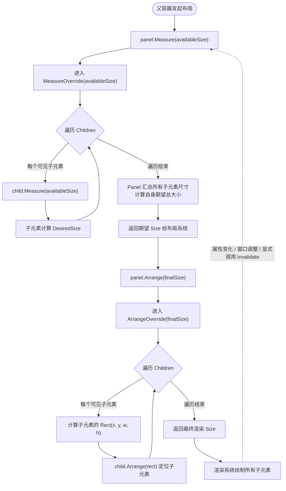

# 003002001_Panel类


> **摘要**：`Panel` 是 WPF 布局系统的唯一抽象基类，继承自 `FrameworkElement`，为所有布局容器提供统一的子元素集合管理、Measure‑Arrange 两步布局契约和可视化树托管。本文从官方定义出发，逐层剖析继承链、五大核心特性、关键属性与方法，详解测量与排列的底层原理（含 Mermaid 流程图与内置面板对比），并梳理了与子元素的交互规则和自定义 Panel 开发规范。实战环节通过从零编写 `SimpleFlowPanel` 完整演示 `MeasureOverride`/`ArrangeOverride` 的重写过程，最后深入探讨性能优化（虚拟化思路、大量子元素处理）与边界条件处理（NaN/Infinity 卫生检查、BeginInit/EndInit 批量操作），形成从理论到工程实践的完整闭环。
`Panel` 是 **WPF 布局系统的绝对核心、所有布局容器的顶层抽象基类**，它直接继承自 `FrameworkElement`，专门为**子元素的排列、布局管理、可视化渲染**提供标准化框架。

简单说：**所有能装控件的「容器」（Grid/StackPanel/Canvas/ 自定义瀑布流），底层全是 Panel**。它定义了 WPF 布局的**统一规则**，开发者只需要基于它实现自定义布局逻辑，无需关心底层渲染、线程、可视化树等复杂逻辑。

------

## 一、官方精准定义

csharp:

```c#
public abstract class Panel : FrameworkElement, IAddChild
```

> **Panel** 是 WPF 的**抽象基类**，为所有布局控件提供统一的子元素集合管理、测量 - 排列布局契约、可视化树托管能力。它是实现界面布局的基础容器，自身不实现具体布局逻辑，仅定义标准接口，由派生类实现不同排列规则（网格、堆叠、绝对定位等）。

### 核心定位

1. **布局容器的根基**：唯一用于创建布局面板的基类；
2. **子元素管理者**：统一管理所有子 `UIElement`；
3. **布局规则制定者**：定义 `Measure-Arrange` 两步布局法；
4. **可视化树托管者**：自动把子元素加入渲染树，无需手动处理。

------

## 二、完整继承链（呼应你之前学的所有基类）

​	Panel 完整继承了底层所有核心能力，是 UI 体系中**专门负责「容器布局」的最终形态**：

```c#
System.Object
└─ System.Windows.Threading.DispatcherObject （UI线程安全）
   └─ System.Windows.DependencyObject （依赖属性/绑定）
      └─ System.Windows.Media.Visual （像素渲染/命中测试）
         └─ System.Windows.UIElement （基础布局/输入/动画）
            └─ System.Windows.FrameworkElement （样式/资源/生命周期）
               └─ System.Windows.Controls.Panel 【布局容器基类：抽象】
                  └─ 所有布局面板（Grid/StackPanel/Canvas/自定义WaterfallPanel）
```

### 每一层继承带来的能力

| 父类             | 给 Panel 提供的能力                     |
| :--------------- | :-------------------------------------- |
| Visual           | 硬件渲染、裁剪、坐标变换、视觉树基础    |
| UIElement        | 测量 / 排列框架、鼠标 / 键盘事件、焦点  |
| FrameworkElement | 样式、数据绑定、资源、生命周期 (Loaded) |
| **Panel 自身**   | **子元素集合、布局契约、可视化树托管**  |

------

## 三、Panel 基类的 5 大核心特性

### 1. 抽象性（无法直接实例化）

- `abstract` 关键字 → **不能写 `new Panel()`**；
- 必须使用派生类（Grid/StackPanel）或**自定义继承类**（你写的瀑布流）；
- 作用：强制所有布局面板遵循统一规范。

### 2. 子元素集合管理（核心能力）

​	Panel 内置 `Children` 属性，专门管理所有子控件，是布局容器的灵魂：

csharp:

```c#
public UIElementCollection Children { get; }
```

- 类型：`UIElementCollection`，线程安全、有序集合；
- 支持：`Add`/`Remove`/`Clear`/`Insert` 操作；
- 自动：子元素加入 `Children` 后，**自动参与布局和渲染**。

### 3. 标准化布局契约（必须重写）

​	Panel 定义了 WPF 布局的**铁律：两步布局法**，提供两个虚拟方法，**所有布局面板必须重写**：

csharp:

```c#
protected virtual Size MeasureOverride(Size availableSize);
protected virtual Size ArrangeOverride(Size finalSize);
```

- 基类默认实现：返回 `Size(0,0)` → 不重写则子元素**完全不显示**；
- 这是你写自定义瀑布流时必须重写这两个方法的原因。

### 4. 自动可视化树托管

​	Panel **重写了 Visual 基类的视觉树方法**：

- `GetVisualChild(int index)`
- `VisualChildrenCount`
- `AddVisualChild`/`RemoveVisualChild`

​	✅ **你无需手动管理**：只要把子元素加入 `Children`，Panel 会自动把它加入视觉树，完成渲染。

### 5. 原生支持布局附加属性

​	Panel 本身不定义附加属性，但它是**布局附加属性的载体**：

- 如 `Grid.Row`、`Canvas.Left`、`WaterfallPanel.ColumnIndex`；
- 附加属性由面板定义，挂载到子元素，专门存储**布局位置信息**。

------

## 四、Panel 基类 核心成员（属性 + 方法）详解

### （1）核心属性

| 属性名                | 类型                | 作用                                                         |
| :-------------------- | :------------------ | :----------------------------------------------------------- |
| `Children`            | UIElementCollection | **最重要**：子元素集合，所有子控件都存在这里                 |
| `Background`          | Brush               | 面板背景色 / 画刷（Panel 独有属性，FrameworkElement 没有）   |
| `IsItemsHost`         | bool                | 标记是否为列表控件（ListBox）的布局容器                      |
| `VisualChildrenCount` | int                 | 重写自 Visual：子视觉元素数量（直接关联 Children）           |
| `LogicalChildren`     | IEnumerable         | 重写自 FrameworkElement：逻辑子元素，支持数据绑定 / 事件传播 |

------

### （2）核心方法（分 3 类）

#### ① 布局失效方法（主动刷新布局）

​	当面板属性（如列数、间距）变化时，调用这些方法强制重新布局：

csharp:

```c#
// 强制重新执行【测量】
public void InvalidateMeasure();
// 强制重新执行【排列】
public void InvalidateArrange();
```

​	👉 你写的瀑布流中 `ColumnCount` 变化时调用 `InvalidateMeasure()`，就是标准用法。

#### ② 必须重写的布局方法（核心契约）

​	这两个方法是**自定义布局的唯一入口**：

csharp:

```c#
// 测量阶段：计算子元素大小 + 面板自身大小
protected override Size MeasureOverride(Size availableSize)

// 排列阶段：计算子元素位置 + 完成布局
protected override Size ArrangeOverride(Size finalSize)
```

#### ③ 可视化树管理方法（基类已实现，子类无需重写）

​	Panel 自动完成视觉树关联，子类**不用写**：

csharp:

```c#
protected override Visual GetVisualChild(int index);
protected override int VisualChildrenCount { get; }
```

------

## 五、Panel 基类的核心工作原理：两步布局法

这是 WPF 布局的**底层原理**，也是你写自定义 Panel 的核心逻辑。



> **图注**：WPF Panel 两步布局法完整流程图。**测量（Measure）阶段**：父容器传入可用空间 → 遍历所有子元素逐个询问期望尺寸 → 汇总后返回面板自身期望大小。**排列（Arrange）阶段**：布局系统根据测量结果分配最终尺寸 → 遍历子元素计算坐标并调用 `child.Arrange(rect)` 完成定位 → 渲染绘制。底部虚线箭头表示：当属性变化、窗口尺寸调整或显式调用 `InvalidateMeasure()` / `InvalidateArrange()` 时，整个流程会**重新触发**，形成闭环。

### 第一步：测量（MeasureOverride）——「你需要多大空间？」

**父容器问子元素：你需要多大空间？**

| 步骤 | 输入 | 操作 | 输出 |
| :--- | :--- | :--- | :--- |
| ① 接收可用空间 | 父容器传入 `availableSize` | `MeasureOverride(availableSize)` 被调用 | — |
| ② 遍历子元素 | `Children` 集合 | 对每个可见子元素调用 `child.Measure(availableSize)` | 子元素内部计算 `DesiredSize` |
| ③ 汇总期望尺寸 | 所有子元素的 `DesiredSize` | 根据布局规则（换行/堆叠/网格）计算面板总大小 | 返回期望 `Size` |

### 第二步：排列（ArrangeOverride）——「你就放在这个位置！」

**父容器告诉子元素：你就放在这个位置！**

| 步骤 | 输入 | 操作 | 输出 |
| :--- | :--- | :--- | :--- |
| ① 接收最终尺寸 | 布局系统传入 `finalSize` | `ArrangeOverride(finalSize)` 被调用 | — |
| ② 遍历子元素 | `Children` 集合 + 子元素 `DesiredSize` | 按布局规则计算每个子元素的 `Rect(x, y, w, h)` | 坐标 + 尺寸 |
| ③ 完成定位 | 每个子元素的 `Rect` | 调用 `child.Arrange(rect)` | 子元素被放置到屏幕具体位置 |

---

### 内置面板布局算法对比

下表横向对比四种常用内置面板在 `MeasureOverride` 和 `ArrangeOverride` 中的核心算法逻辑：

| 面板类型 | MeasureOverride 核心逻辑 | ArrangeOverride 核心逻辑 |
| :--- | :--- | :--- |
| **Grid** | 遍历所有子元素并调用 `Measure`，按行/列定义分别统计每行最大高度和每列最大宽度；存在星号（`*`）列时，先分配固定和 Auto 尺寸后再按比例分配剩余空间。 | 根据子元素所在 `Grid.Row` / `Grid.Column` 及行列最终尺寸，计算每个子元素的 `Rect`，使子元素在单元格内按 `HorizontalAlignment` / `VerticalAlignment` 对齐。 |
| **StackPanel** | 在堆叠方向（水平或垂直）上逐个测量子元素，沿堆叠方向累加尺寸（宽度或高度），垂直方向取子元素最大尺寸；非堆叠方向子元素会被拉伸或按自身尺寸保留。 | 沿堆叠方向依次排列子元素，每个子元素的坐标在前一个元素末尾 + 间距处，垂直方向则按面板高度或最大元素高度对齐。 |
| **Canvas** | 直接调用 `child.Measure` 且传入无穷大尺寸（`double.PositiveInfinity`），让子元素自由计算其自然尺寸；面板自身期望大小通常为 0×0，不限制子元素。 | 根据子元素上设置的 `Canvas.Left` / `Canvas.Top` 附加属性值直接定位，不关心子元素之间的相对关系；若未设置则默认放在 (0, 0)。 |
| **WrapPanel** | 逐子元素水平排列，累加宽度，超出可用宽度时自动换行并累加行高；换行后新行从水平起点重新开始排列，最终返回所有行累加的总宽度和总高度。 | 按测量阶段确定的换行方案，为每个子元素分配坐标：同行子元素从左到右排列，换行时重置 X 坐标并从下一行顶部开始。 |

> **要点**：所有内置面板都遵循相同的 `MeasureOverride` / `ArrangeOverride` 契约，差异仅在于**遍历时如何利用可用空间**和**坐标如何计算**——这正是 Panel 基类「定义框架、子类实现规则」设计哲学的体现。

------

## 六、Panel 基类与子元素的交互规则

1. **子元素必须是 `UIElement`**：Panel 只管理 UI 元素（控件、图形、文本）；
2. **隐藏元素自动跳过**：`Visibility.Collapsed` 不参与测量 / 排列；
3. **自动渲染**：加入 `Children` 即渲染，移除即消失；
4. **布局事件冒泡**：子元素大小变化，自动通知面板刷新。

------

## 七、Panel 基类的标准派生类（内置布局面板）

​	所有你日常用的容器，都是 Panel 的子类：

| 派生类                   | 布局规则                | 适用场景                  |
| :----------------------- | :---------------------- | :------------------------ |
| `Grid`                   | 二维网格布局            | 表单、复杂界面            |
| `StackPanel`             | 线性堆叠（水平 / 垂直） | 按钮组、简单列表          |
| `Canvas`                 | 绝对坐标定位            | 绘图、自定义图形          |
| `WrapPanel`              | 流式自动换行            | 标签云、图片墙            |
| `DockPanel`              | 边缘停靠                | 界面分区（导航 + 状态栏） |
| `UniformGrid`            | 等大小网格              | 计算器、九宫格            |
| `VirtualizingStackPanel` | 虚拟化堆叠（高性能）    | 十万条数据列表            |
| **WaterfallPanel**       | 瀑布流（最短列优先）    | 自定义布局（你写的）      |

------

## 八、自定义 Panel 的规范（基于基类约束）

​	结合你写的**瀑布流面板**，这是 Panel 基类强制要求的**开发规范**：

1. **必须继承 Panel**；
2. **必须重写 `MeasureOverride` + `ArrangeOverride`**；
3. 遍历 `Children` 时，**跳过 `Visibility.Collapsed` 元素**；
4. **必须调用 `child.Measure()` 和 `child.Arrange()`**（不调用则元素不显示）；
5. 用**附加属性**存储子元素布局信息；
6. 配置属性变化时，调用 `InvalidateMeasure()` 刷新布局；
7. 不手动管理可视化树（基类已实现）。

------

## 九、Panel vs UIElement vs FrameworkElement（核心区别）

| 类名               | 定位             | 子元素管理      | 布局能力         | 开发者使用场景   |
| :----------------- | :--------------- | :-------------- | :--------------- | :--------------- |
| `UIElement`        | 基础交互元素     | ❌ 无            | 基础框架         | 自定义轻量级控件 |
| `FrameworkElement` | 业务级 UI 元素   | ❌ 无            | 基础布局         | 标准控件基类     |
| **`Panel`**        | **布局容器基类** | ✅ 有 (Children) | **完整布局契约** | **所有布局容器** |

------

## 十、总结（核心记忆点）

1. **Panel 是 WPF 布局容器的唯一抽象基类**，所有容器都继承它；
2. 核心能力：**子元素管理 + 两步布局法 + 可视化树托管**；
3. 自定义布局只需要做一件事：**重写 `MeasureOverride` 和 `ArrangeOverride`**；
4. 基类提供框架，子类实现规则（Grid 是网格、你写的是瀑布流）；
5. 它是连接「底层渲染」和「界面布局」的核心桥梁。

一句话概括：

​	**Visual 负责画，UIElement 负责交互，FrameworkElement 负责业务，Panel 负责把它们摆整齐！**

------

## 十一、实战：自定义简单流式布局面板

学完前面的理论，我们动手写一个**最简化版的 WrapPanel**，从零继承 `Panel`，完整实现 `MeasureOverride` + `ArrangeOverride`，加深对两步布局法的理解。

### 布局规则

- 子元素按水平方向依次排列；
- 当前行放不下时自动换行；
- 自动跳过 `Visibility.Collapsed` 的隐藏元素。

### 完整代码（可直接复制运行）

```c#
using System;
using System.Collections.Generic;
using System.Windows;
using System.Windows.Controls;

namespace CustomPanels
{
    /// <summary>
    /// 自定义水平流式布局面板 —— 最简化版 WrapPanel。
    /// 子元素从左往右排列，超出面板宽度时自动换行。
    /// </summary>
    public class SimpleFlowPanel : Panel
    {
        // ========== 依赖属性 ==========

        /// <summary>
        /// 水平间距（像素）
        /// </summary>
        public double HorizontalSpacing
        {
            get => (double)GetValue(HorizontalSpacingProperty);
            set => SetValue(HorizontalSpacingProperty, value);
        }

        public static readonly DependencyProperty HorizontalSpacingProperty =
            DependencyProperty.Register(
                nameof(HorizontalSpacing),
                typeof(double),
                typeof(SimpleFlowPanel),
                new FrameworkPropertyMetadata(5.0,
                    FrameworkPropertyMetadataOptions.AffectsMeasure));

        /// <summary>
        /// 垂直间距（像素）
        /// </summary>
        public double VerticalSpacing
        {
            get => (double)GetValue(VerticalSpacingProperty);
            set => SetValue(VerticalSpacingProperty, value);
        }

        public static readonly DependencyProperty VerticalSpacingProperty =
            DependencyProperty.Register(
                nameof(VerticalSpacing),
                typeof(double),
                typeof(SimpleFlowPanel),
                new FrameworkPropertyMetadata(5.0,
                    FrameworkPropertyMetadataOptions.AffectsMeasure));

        // ========== 第一步：测量 ==========

        /// <summary>
        /// 测量阶段：遍历所有子元素，计算每个元素的期望尺寸，同时确定换行位置。
        /// 返回整个面板需要的总尺寸。
        /// </summary>
        protected override Size MeasureOverride(Size availableSize)
        {
            var totalSize = new Size();       // 面板所需的最终总尺寸
            double currentLineWidth = 0;      // 当前行累计宽度
            double currentLineHeight = 0;     // 当前行最高元素的高度
            double totalHeight = 0;           // 所有行累计高度

            // 遍历所有子元素
            foreach (UIElement child in Children)
            {
                // 关键：跳过隐藏元素
                if (child.Visibility == Visibility.Collapsed)
                    continue;

                // 让子元素自行测量 —— 这是必须调用的！
                child.Measure(availableSize);
                Size childDesiredSize = child.DesiredSize;

                // 判断当前行是否放得下
                if (currentLineWidth + childDesiredSize.Width > availableSize.Width
                    && availableSize.Width > 0
                    && currentLineWidth > 0)
                {
                    // 换行：当前行结束，累加行高
                    totalHeight += currentLineHeight + VerticalSpacing;
                    currentLineWidth = 0;
                    currentLineHeight = 0;
                }

                // 更新当前行数据
                currentLineWidth += childDesiredSize.Width + HorizontalSpacing;
                currentLineHeight = Math.Max(currentLineHeight, childDesiredSize.Height);
            }

            // 最后一行也要计入总高度
            totalHeight += currentLineHeight;

            // 总宽度取可用宽度和实际内容宽度的较大值
            totalSize.Width = double.IsPositiveInfinity(availableSize.Width)
                ? currentLineWidth
                : Math.Max(currentLineWidth, availableSize.Width);

            totalSize.Height = totalHeight;
            return totalSize;
        }

        // ========== 第二步：排列 ==========

        /// <summary>
        /// 排列阶段：根据测量阶段确定的换行方案，为每个子元素设置最终位置。
        /// </summary>
        protected override Size ArrangeOverride(Size finalSize)
        {
            double x = 0;                       // 当前水平坐标
            double y = 0;                       // 当前垂直坐标
            double currentLineHeight = 0;       // 当前行最高元素高度

            foreach (UIElement child in Children)
            {
                // 再次跳过隐藏元素
                if (child.Visibility == Visibility.Collapsed)
                    continue;

                Size childSize = child.DesiredSize;

                // 判断是否需要换行
                if (x + childSize.Width > finalSize.Width
                    && finalSize.Width > 0
                    && x > 0)
                {
                    x = 0;
                    y += currentLineHeight + VerticalSpacing;
                    currentLineHeight = 0;
                }

                // 定位子元素 —— 必须调用 Arrange！
                var childRect = new Rect(x, y, childSize.Width, childSize.Height);
                child.Arrange(childRect);

                // 更新坐标
                x += childSize.Width + HorizontalSpacing;
                currentLineHeight = Math.Max(currentLineHeight, childSize.Height);
            }

            return finalSize;
        }
    }
}
```

### 使用示例（XAML）

```xml
<Window xmlns="http://schemas.microsoft.com/winfx/2006/xaml/presentation"
        xmlns:local="clr-namespace:CustomPanels">
    <local:SimpleFlowPanel HorizontalSpacing="10" VerticalSpacing="8">
        <Button Content="按钮1" Width="100" Height="40"/>
        <Button Content="按钮2" Width="120" Height="40"/>
        <Button Content="按钮3" Width="80" Height="40"/>
        <Button Content="按钮4" Width="140" Height="40"/>
        <Button Content="按钮5" Width="100" Height="40"/>
    </local:SimpleFlowPanel>
</Window>
```

### 关键步骤拆解

| 步骤 | 你在做的事 | 对应方法 |
| :--- | :--- | :--- |
| **1. 继承 Panel** | 获得 `Children` 集合 + 布局框架 | `class SimpleFlowPanel : Panel` |
| **2. 跳过隐藏元素** | `Visibility.Collapsed` 不占位 | `if (child.Visibility == Visibility.Collapsed) continue;` |
| **3. 调用 child.Measure()** | 让子元素计算自己的期望尺寸 | `child.Measure(availableSize);` |
| **4. 判断换行** | 当前行宽度超出可用空间 → 换行 | `if (x + childSize.Width > finalSize.Width)` |
| **5. 调用 child.Arrange()** | 给子元素指定最终位置 | `child.Arrange(new Rect(x, y, w, h));` |
| **6. 间距属性** | 依赖属性 + `AffectsMeasure` 自动触发重布局 | `FrameworkPropertyMetadataOptions.AffectsMeasure` |

### 核心要点回顾

- **不调用 `child.Measure()` → 子元素 `DesiredSize` 为 0 → 不显示。**
- **不调用 `child.Arrange()` → 子元素位置未确定 → 不显示。**
- **跳过 `Collapsed` 元素 → 隐藏控件不占布局空间。**
- **间距属性标记 `AffectsMeasure` → 属性值变化时自动触发重新测量，无需手动调用 `InvalidateMeasure()`。**

掌握这个 SimpleFlowPanel 之后，理解 Grid、Canvas、WrapPanel 等内置面板的实现原理就如鱼得水了——它们都遵循同样的两步布局法，只是排列规则不同而已。


------

## 十二、性能优化与边界条件

前面的 `SimpleFlowPanel` 已经能跑，但真实的 WPF 应用动辄几百甚至上千个元素，性能和健壮性才是考验自定义 Panel 真功夫的地方。

### 1. 虚拟化（VirtualizingPanel）带来的思路

WPF 专门为大数据量列表类容器设计了 **`VirtualizingPanel`** 抽象基类，它就是 `VirtualizingStackPanel` 的根基。其核心原理只有一句话：

> **只测量和渲染当前可见范围内的子元素，回收屏幕外元素的可视化树和布局计算。**

**适用场景**：
- 列表或网格中绑定了数百、数千条数据（如商品列表、日志预览）。
- 每个子元素有一定复杂度（带模板、图片等），全部加载内存会卡顿。
- 容器允许滚动（配合 `ScrollViewer` 或 `ItemsControl`）。

**重要提醒**：
> `VirtualizingPanel` 不是万金油，它需要子元素支持「回收重用」机制；对于完全自定义、元素尺寸高度不一致且行布局复杂的 Panel（如瀑布流），要实现真正的虚拟化非常困难。官方的 `WrapPanel` **不支持**内置虚拟化，自定义 `SimpleFlowPanel` 也同样不会自动享受虚拟化能力。

### 2. 大量子元素的性能痛点与优化思路

当 `SimpleFlowPanel` 里塞入 **1000 个以上的子元素** 时，即使子元素很简单（如 `TextBlock`），每次 `MeasureOverride` 和 `ArrangeOverride` 都会遍历全部 `Children`。这会带来三个直接问题：

- **CPU 密集**：每一次鼠标移动、窗口大小变化都可能触发全量重新测量和排列。
- **视觉树膨胀**：即使不可见，所有子元素都在视觉树里，占用内存和绘制资源。
- **滚动不流畅**：没有虚拟化，滚动时需要测量 / 排列全部子元素。

**优化思路**：

1. **限制可见范围（简单截断）**
   - 如果子元素数量可以预测，可以在 `MeasureOverride` / `ArrangeOverride` 中只处理可见区域内的元素，但 `Children` 本身并不会自动变小，需要自己维护一个“虚拟子元素列表”。
   - 一种折中方案：不在 `Panel` 内部硬处理，而是在外部用 `ItemsControl` 的 `ItemContainerGenerator` 控制生成实际控件，再利用 `VirtualizingStackPanel` 实现滚动虚拟化。

2. **延迟加载 / 分页**
   - 一次只将前 N 个子元素（如 50 个）加入 `Children`，超出部分按需加载。
   - 可以监听父容器的滚动偏移，手动控制添加 / 移除子元素，但实现复杂度较高。

3. **减小布局频率**
   - 利用依赖属性的 `AffectsMeasure` 精细化控制哪些属性真的需要重新测量（前文 `HorizontalSpacing` / `VerticalSpacing` 已标记为 `AffectsMeasure`，一个值变化就会触发完整布局；如有大量无变化的属性，可以不用此标记）。
   - 对于频繁变动的尺寸，可以手动缓冲并批量调用 `InvalidateMeasure()`，而不是每次都立即布局。

4. **避免在测量中做重运算**
   - 不要在 `MeasureOverride` 内部进行复杂计算、I/O 或频繁创建临时对象。
   - 预计算子元素尺寸缓存（如已知每个子元素固定大小，可直接推算）。

**实用建议**：
如果确实需要展示成千上万条数据，**优先考虑**：

```
ItemsControl + WrapPanel + ScrollViewer(CanContentScroll=False，即物理滚动)
```

但不要期望 `WrapPanel` 自身会有高性能虚拟化。更好的方案是换用 `WrapPanel` 的虚拟化变体（部分商业控件库提供），或在业务层面将长列表拆成多个小页面 / 分组折叠。

### 3. 边界条件处理：安全、健壮的自定义 Panel

真实世界的子元素可能尺寸异常或动态变化，不作处理容易引发崩溃或卡死。

#### 尺寸为 0、NaN、Infinity 的处理策略

在 `MeasureOverride` 和 `ArrangeOverride` 中，子元素的 `DesiredSize` 可能会是：

- `0`：合法但会导致该子元素不占用空间。
- `NaN`：非常危险，如果用 `NaN` 构造 `Rect` 或参与算术会抛异常。
- `Infinity` / `PositiveInfinity` / `NegativeInfinity`：虽然不一定会直接崩溃，但会导致无效的布局计算。

**安全的做法**：在使用前对子元素尺寸进行「卫生检查」。

```c#
private static Size SanitizeSize(Size input)
{
    double width = input.Width;
    double height = input.Height;

    // NaN 或无穷大或负值一律视为 0
    if (double.IsNaN(width) || double.IsInfinity(width) || width < 0)
        width = 0;
    if (double.IsNaN(height) || double.IsInfinity(height) || height < 0)
        height = 0;

    return new Size(width, height);
}
```

然后在 `MeasureOverride` 中获取 `child.DesiredSize` 后先 `SanitizeSize` 再参与布局计算；在 `ArrangeOverride` 中也用清洗后的尺寸构造 `Rect`。

**子元素尺寸为 0 的特殊处理**：
- 在流式布局中，高度为 0 的子元素可以正常放在行内，不会撑高行高，但也无需刻意跳过。
- 如果需要隐藏，建议让外部显式设置 `Visibility.Collapsed`，Panel 只负责根据可见性跳过即可。

#### 子元素动态增删时的布局刷新

当运行时动态添加或移除子元素时，`Children` 集合变化会自动通知 Panel 重新布局吗？

- 直接调用 `Children.Add` / `Remove` 会触发 `InvalidateMeasure` 和 `InvalidateArrange`，**通常**不需要手动干预。
- 但如果在一次操作中大批量增删（例如循环添加 100 个元素），每添加一个都触发一次布局，会造成严重性能浪费。

**优化方式**：

1. **批量操作期间暂时 UI 虚拟化**
   - 使用 `using (Dispatcher.DisableProcessing())` 或先 `Visibility = Collapsed` 面板，批量操作完成后再恢复，触发一次整体布局。

2. **手动控制布局刷新**
   - 在批量添加前设置 `IsHitTestVisible = false` 或挂起布局（如 `Dispatcher.PushFrame`），完成后调用一次 `InvalidateMeasure`。

3. **响应子元素自身属性变化**
   - 如果子元素的 `Width`/`Height` 或内容的 `RenderSize` 动态变化（如动画），子元素自身会向上引发 `MeasureDirty` 通知，Panel 无需额外处理。

**推荐健壮模式**：

- 在 `MeasureOverride` / `ArrangeOverride` 开头就检查 `Children.Count`，如果数量巨大且只遍历一次，务必确保每一次循环都不做多余操作。
- 当需要频繁增删大量子元素时，尽量通过数据绑定和 `ItemsControl` 完成，不要手动直接操作 `Children` 集合，除非你真的在写一个轻量的自定义面板。
#### 实战：在 SimpleFlowPanel 中集成尺寸卫生检查

将前面讲解的 `SanitizeSize` 方法整合进 `MeasureOverride`，确保每个子元素的尺寸都经过清洗，杜绝 NaN/Infinity 引发的布局崩溃：

```c#
protected override Size MeasureOverride(Size availableSize)
{
    var totalSize = new Size();
    double currentLineWidth = 0;
    double currentLineHeight = 0;
    double totalHeight = 0;

    foreach (UIElement child in Children)
    {
        if (child.Visibility == Visibility.Collapsed)
            continue;

        child.Measure(availableSize);

        // ✅ 关键：对子元素的 DesiredSize 做卫生检查，防止 NaN/Infinity 参与计算
        Size childDesiredSize = SanitizeSize(child.DesiredSize);

        if (currentLineWidth + childDesiredSize.Width > availableSize.Width
            && availableSize.Width > 0
            && currentLineWidth > 0)
        {
            totalHeight += currentLineHeight + VerticalSpacing;
            currentLineWidth = 0;
            currentLineHeight = 0;
        }

        currentLineWidth += childDesiredSize.Width + HorizontalSpacing;
        currentLineHeight = Math.Max(currentLineHeight, childDesiredSize.Height);
    }

    totalHeight += currentLineHeight;
    totalSize.Width = double.IsPositiveInfinity(availableSize.Width)
        ? currentLineWidth
        : Math.Max(currentLineWidth, availableSize.Width);
    totalSize.Height = totalHeight;
    return totalSize;
}

/// <summary>
/// 对子元素尺寸进行安全清洗：NaN → 0，Infinity → 0，负值 → 0。
/// 防止异常尺寸导致 Rect 构造或算术运算崩溃。
/// </summary>
private static Size SanitizeSize(Size input)
{
    double width = input.Width;
    double height = input.Height;

    if (double.IsNaN(width) || double.IsInfinity(width) || width < 0)
        width = 0;
    if (double.IsNaN(height) || double.IsInfinity(height) || height < 0)
        height = 0;

    return new Size(width, height);
}
```

同理，在 `ArrangeOverride` 中使用 `child.DesiredSize` 构造 `Rect` 之前，也建议调用一次 `SanitizeSize`，防止异常尺寸传入 `Rect` 构造函数：

```c#
// 在 ArrangeOverride 的 foreach 循环体内：
Size safeSize = SanitizeSize(child.DesiredSize);
var childRect = new Rect(x, y, safeSize.Width, safeSize.Height);
child.Arrange(childRect);
```

#### 实战：使用 BeginInit/EndInit 模式批量操作子元素

当需要**一次性添加几十甚至上百个子元素**时，逐次操作会触发多次重新布局，造成严重的性能浪费。WPF 提供了 `ISupportInitialize` 接口 + `BeginInit`/`EndInit` 模式来优雅地解决这个问题：

```c#
using System.ComponentModel;  // 提供 ISupportInitialize

/// <summary>
/// 增强版流式布局面板 —— 支持批量子元素操作。
/// </summary>
public class SimpleFlowPanel : Panel, ISupportInitialize
{
    private bool _isInitializing;   // 是否处于批量初始化状态

    // ========== 批量操作接口 ==========

    /// <summary>
    /// 进入批量模式：在此期间所有子元素增删都不会触发布局刷新。
    /// </summary>
    public void BeginInit()
    {
        _isInitializing = true;
    }

    /// <summary>
    /// 退出批量模式：统一触发一次完整布局刷新。
    /// </summary>
    public void EndInit()
    {
        _isInitializing = false;
        InvalidateMeasure();        // 批量操作完成后，一次性刷新测量
        InvalidateArrange();        // 一次性刷新排列
    }

    // ========== 重写布局方法，感知批量状态 ==========

    protected override Size MeasureOverride(Size availableSize)
    {
        // 如果正在批量初始化，跳过测量，避免空跑
        if (_isInitializing)
            return new Size();

        // ... 原有的测量逻辑 ...
    }

    protected override Size ArrangeOverride(Size finalSize)
    {
        // 如果正在批量初始化，跳过排列
        if (_isInitializing)
            return finalSize;

        // ... 原有的排列逻辑 ...
    }
}
```

**使用示例**：

```c#
var panel = new SimpleFlowPanel();

// 进入批量模式 —— 布局被冻结
panel.BeginInit();
try
{
    for (int i = 0; i < 100; i++)
    {
        panel.Children.Add(new Button
        {
            Content = $"按钮 {i + 1}",
            Width = 100,
            Height = 40
        });
    }
    // 这 100 次 Add 都不会触发布局刷新！
}
finally
{
    // 退出批量模式 —— 一次性完成测量 + 排列
    panel.EndInit();
}
```

**关键要点**：
- `BeginInit()` 调用后，`MeasureOverride` / `ArrangeOverride` 直接返回空结果，避免无效计算；
- `EndInit()` 调用后，通过 `InvalidateMeasure()` + `InvalidateArrange()` 触发**仅一次**完整布局；
- `try-finally` 确保即使中途异常也能退出批量模式，避免面板卡在初始化状态。

> **适用场景**：XAML 解析器在加载窗口时自动使用 `BeginInit`/`EndInit` 包裹控件树的构建过程，这也是为什么你在 XAML 里写一百个按钮，界面不会闪一百次的原因之一。

### 小结

- **虚拟化** 是高性能数据展示的终极武器，但自己实现极其复杂，优先使用 WPF 内置支持。
- **大量子元素** 场景一定要先测量性能瓶颈，再考虑限流、截断或换用更适合的容器。
- **边界条件**（0、NaN、Infinity、动态增删）必须主动防护，否则再漂亮的布局算法也会崩在异常数据上。。


